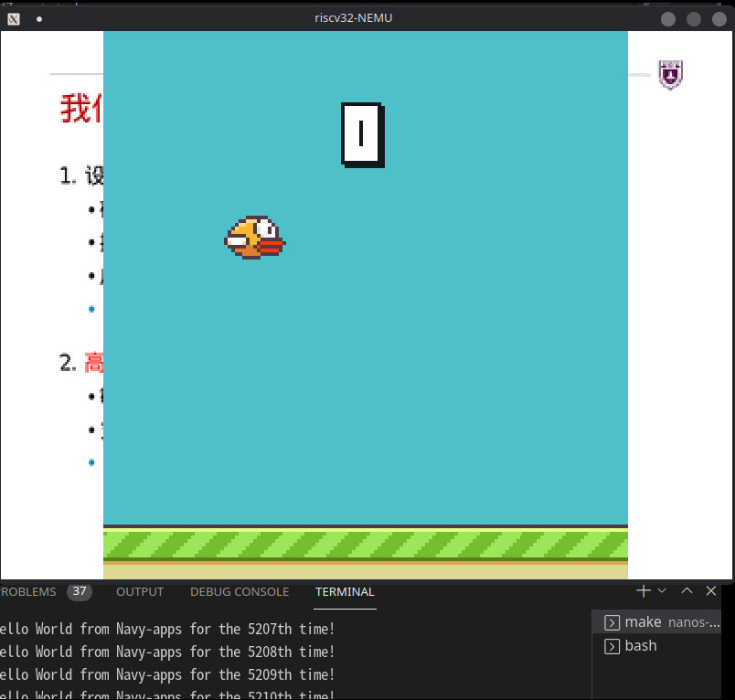

# PA 4

## 201300035 方盛俊

非常痛苦的是, 只要我的 PDF 文件一过大, `make submit` 就一定会失败. 如果想要看更详细的实验报告, 可以看 `report.md` 这个 Markdown 文件.

## 4. 必答题

### 4.0 展示你的计算机系统



### 4.1 分时多任务的具体过程

### 4.2 理解计算机系统

尝试在Linux中编写并运行以下程序:

```c
int main() {
  char *p = "abc";
  p[0] = 'A';
  return 0;
}
```

会看到程序因为往只读字符串进行写入而触发了段错误.
