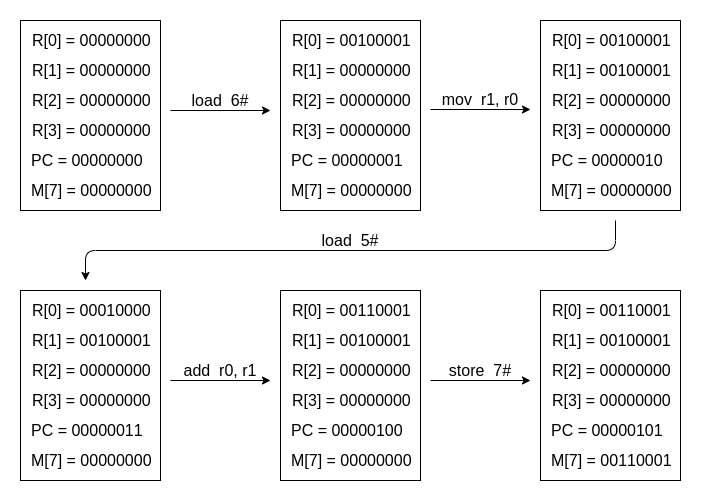

# PA 2

## 201300035 方盛俊

## 1. 不停计算的机器

### 1.1 YEMU 上执行加法程序的状态机



### 1.2 YEMU 如何执行一条指令

1. 从存储器中, 根据 `pc` 从对应位置取出一条指令.
2. 根据指令 `op` 进行操作码译码.
3. 根据指令内容进行操作数译码.
4. 根据指令译码结果执行.
5. 更新 `pc`.

## 2. 阶段一: RTFSC

### 2.1 立即数背后的故事

> **Question:** mips32 和 riscv32 的指令长度只有 32 位, 因此它们不能像 x86 那样, 把 C 代码中的 32 位常数直接编码到一条指令中. 思考一下, mips32 和 riscv32应该如何解决这个问题?
>
> **Answer:** 使用 lui 和 addi 两条指令完成. 先用 lui 移动数据的高 20 位, 再用 addi 移动数据的低 12 位.

### 2.2 为什么不需要 rtl_muls_lo?

> **Question:** 我们没有定义用于获取有符号数乘法结果低 32 位的 RTL 基本指令 rtl_muls_lo, 你知道为什么吗?
>
> **Answer:** 我们可以使用无符号乘法结果低 32 位的 RTL 基本指令 rtl_mulu_lo 实现有符号数乘法结果低 32 位.

### 2.3 拓展宏

使用 `gcc -E` 等命令, 改造 Makefile 里的内容, 在 `build` 文件夹下生成了预编译过后的代码文件 `*.i`.

### 2.4 RTFSC

通过 RTFSC, 我逐渐理解了客户端程序每一条指令的执行过程, 分为:

1. 取指(instruction fetch, IF)
2. 译码(instruction decode, ID)
3. 执行(execute, EX)
4. 更新 PC

这些过程中, 使用到了许多的辅助函数, 我们通过编写这些辅助函数, 可以减少代码的耦合性, 可以更方便地加入需要的新指令.

### 2.5 添加新指令

添加一条新指令, 我们需要更改以下几个文件:

1. `isa-all-instr.h`: 我们需要在这个文件中加入指令的名称, 如 `f(jal) `.
2. `decode.h`: 我们需要在这个文件中加入指令的 `op` 和 `func3` 等标识码.
3. `instr/*.h`: 例如 `compute.h` 文件, 我们要在这个文件中加入 `addi` 指令的话, 就在里面用 RTL 语言来编写指令的功能.

可能还需要关注的几个文件:

1. `rtl-basic.h`: 定义了最为基础和常用的 RTL 语言的实现, 例如 `rtl_addi`.
2. `pseudo.h`: 定义了一些伪指令, 例如 `rtl_li`, 新的伪指令 (ISA 无关) 也在这里实现.

为了运行 `dummy`, 我实现了 `auipc, addi, jal, jalr` 这四条指令.

## 3. 阶段二: 基础设施与程序

### 3.1 DiffTest

DiffTest 真是一个非常智慧的实现. 每个人在写代码的时候, 都会有意无意地使用 DiffTest 的思想: 我在实现自己的代码的过程中, 不断与一个正确的实现进行对比, 就能及早发现 Error.

按照软件工程相关的概念, DiffTest 有助于我们在碰到 Error, 如寄存器状态和正确实现不符时, 直接转为 Failure 报错, 以达到尽快发现错误指令实现的 Fault 的效果.

在按文档配置了 DiffTest 之后, 我在 `dut.c` 文件中实现了寄存器对比的函数:

``` c
bool isa_difftest_checkregs(CPU_state *ref_r, vaddr_t pc) {
    if (cpu.pc != ref_r->pc) return false;
    for (int i = 0; i < 32; ++i) {
        if (cpu.gpr[i]._32 != ref_r->gpr[i]._32) return false; 
    }
    return true;
}
```

便能够使用 DiffTest 的强大功能了, 在实现过程中, 我也再次惊叹于 riscv 寄存器实现的简洁, 这大大减少了我的工作量.

在这个过程中, 我还重新对 VSCode 的调试功能进行配置, 以让他能够继续调试添加了 DiffTest 功能的 NEMU 代码.

### 3.2 指令环形缓冲区 - iringbuf

为了快速定位出错指令位置, 及其对应上下文指令, 我实现了 iringbuf 功能.

大概过程, 就是在 `cpu-exec.c` 文件内, 加入了以下代码:

``` c
// iringbuf
#define MAX_IRINGBUF_LENGTH 8
typedef char buf[128];
buf iringbuf[MAX_IRINGBUF_LENGTH];
uint32_t iringbuf_count = 0;

static void trace_and_difftest(Decode *_this, vaddr_t dnpc) {
    // iringbuf
    strcpy(iringbuf[iringbuf_count % MAX_IRINGBUF_LENGTH], _this->logbuf);
    iringbuf[iringbuf_count % MAX_IRINGBUF_LENGTH][strlen(_this->logbuf)] = '\0';
    ++iringbuf_count;
}

void cpu_exec(uint64_t n) {
    switch (nemu_state.state) {
        case NEMU_ABORT:
            // iringbuf
            printf("--------------------------\n");
            printf("[iringbuf]:\n");
            for (int i = 0; i < MAX_IRINGBUF_LENGTH - 1; ++i) {
                printf("    %s\n", iringbuf[(iringbuf_count + i) % MAX_IRINGBUF_LENGTH]);
            }
            printf("--> %s\n\n\n", iringbuf[(iringbuf_count + 7) % MAX_IRINGBUF_LENGTH]);
    }
}
```

最后输出了以下格式的内容:

``` text
--------------------------
[iringbuf]:
    0x80000050: 13 09 89 16 addi        s2, s2, 360
    0x80000054: 93 89 04 02 addi        s3, s1, 32
    0x80000058: 13 04 84 1a addi        s0, s0, 424
    0x8000005c: 03 25 04 00 lw  a0, 0(s0)
    0x80000060: 83 27 09 00 lw  a5, 0(s2)
    0x80000064: 13 04 44 00 addi        s0, s0, 4
    0x80000068: 13 55 75 00 srli        a0, a0, 7
--> 0x8000006c: 33 05 f5 40 sub a0, a0, a5
```

### 3.3 klib

AM 中需要我们实现的 klib 函数有这些:

1. `malloc`, `free`
2. `strlen`, `strcpy`, `strncpy`, `strcat`, `strcmp`, `strncmp`, `memset`, `memcpy`, `memmove`, `memcmp`
3. `printf`, `vsnprintf`, `snprintf`, `vsprintf`, `sprintf`

后两项已经实现, 可以通过 `string` 和 `hello-str` 样例.

但是第一项 `malloc` 和 `free` 暂未实现, 打算留到之后实现.


### 3.4 mtrace

实现 mtrace, 有助于让我们找出不正确的访存, 帮助我们进行 bug 的诊断.

我在 `Kconfig` 文件加入了以下选项:

``` kconfig
config MTRACE
  depends on TRACE && TARGET_NATIVE_ELF && ENGINE_INTERPRETER
  bool "Enable memory tracer"
  default y

config MTRACE_READ
  depends on MTRACE
  bool "Only trace memories when the it is read"
  default n
  
config MTRACE_WRITE
  depends on MTRACE
  bool "Only trace memories when the it is write"
  default y
```

然后修改 `paddr.c` 的代码为:

``` c
word_t paddr_read(paddr_t addr, int len) {
#ifdef CONFIG_MTRACE_READ
  log_write("paddr_read(%x, %d) = %u\n", addr, len, pmem_read(addr, len));
#endif
  # ...
}

void paddr_write(paddr_t addr, int len, word_t data) {
#ifdef CONFIG_MTRACE_WRITE
  log_write("paddr_write(%x, %d, %u)\n", addr, len, data);
#endif
  # ...
}
```

最后输出如下:

``` text
paddr_write(80008fe0, 4, 0)
0x80000044: 23 28 21 01 sw	s2, 16(sp)
paddr_write(80008fd8, 4, 0)
0x80000048: 23 24 41 01 sw	s4, 8(sp)
0x8000004c: 13 09 44 24 addi	s2, s0, 580
paddr_write(80008fec, 4, 2147484132)
0x80000050: 23 2e 11 00 sw	ra, 28(sp)
```