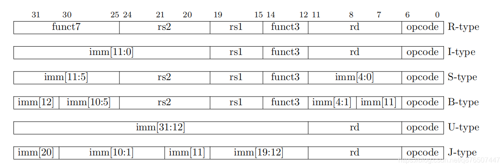
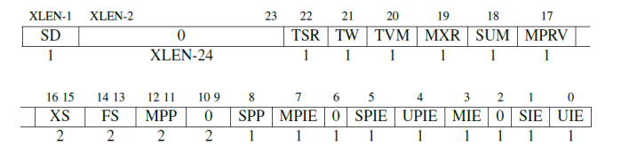
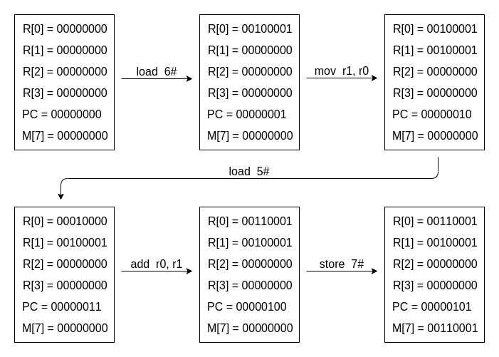

# ICS PA

## PA 0

### 1. Installing GNU/Linux

安装环境永远是最头疼的东西之一.

#### 1.1 第一个坑: WSL 不支持 systemctl 与 service 等命令

尽管在 pa0 的部分更推荐使用 vim 进行代码的编辑, 我仍然决定尝试用 VSCode 来编辑 (部分原因是已经习惯了 VSCode 的很多快捷键).

并且还想尝试一下, 用 Windows 下的 WSL2 (以下均简称为 WSL) 代替真正的 Linux 来开发, 这样就省去了在两个系统中切换的麻烦, 也能够更加方便地使用 VSCode 来开发.

因为 WSL 是 Windows 的一个子系统, 所以默认并不是以 systemd 作为初始化进程, 也就无法使用 systemctl, 如果用到了, 就会报错:

``` text
System has not been booted with systemd as init system (PID 1). Can't operate.
```

经过初步的 STFW 发现, 很多人是在 Docker 时遇到了这个问题, 对应的解决方案对我来说没有多大用处. 再经过一番痛苦的 STFW 之后, 发现了一个相对靠谱且简单的解决方案.

这里我用的 WSL 系统是 Ubuntu, 对应的解决方案为 `ubuntu-wsl2-systemd-script`:

``` bash
sudo apt install git
git clone https://github.com/DamionGans/ubuntu-wsl2-systemd-script.git
cd ubuntu-wsl2-systemd-script/
bash ubuntu-wsl2-systemd-script.sh
```

解决方案来自 [这里](https://c4ys.com/archives/2440).

#### 1.2 第二个坑: WSL 原生不支持图形界面和音频播放

在尝试运行 FCEUX 中的 mario 的时候, 果不其然, 报错了.

报错信息大概如下:

``` text
ALSA lib confmisc.c:768:(parse_card) cannot find card '0'
ALSA lib conf.c:4292:(_snd_config_evaluate) function snd_func_card_driver returned error: No such file or directory
ALSA lib confmisc.c:392:(snd_func_concat) error evaluating strings
```

经过搜寻, 大概是 WSL 中 Linux 自带的音频功能 ALSA 工作不正常, 不能使用.

尝试解决问题, 无果, 迫不得已先放弃 WSL, 果然 WSL 当成普通的 Linux 开发环境还行, 但是过于底层的开发, 或者说涉及到图形界面开发, 还是用正常一点的 Linux 环境吧.

#### 1.3 安装 Kubuntu Linux 与 Windows 双系统

Windows 下有很多资料, 也安装了很多软件, 不太想直接重装. 如果开 Linux 虚拟机的话, 又感觉没那么快乐 (奇怪的说法), 还是试试双系统吧.

先是 Manjaro, 好不容易配好了, 却发现包管理的问题很难解决, 尝试了一番, 还是打算用回 Debian 系的 Ubuntu.

但是我又不太喜 Ubuntu 默认选用的 Gnome 桌面环境, 所以最终选择了以 KDE 为桌面环境的 Kubuntu, 这样比较好看.

经过一番折腾, 终于配好了双系统到环境, 没有造成数据损失, 真是可喜可贺可喜可贺.

### 2. First Exploration with GNU/Linux

####  2.1 Why Windows is quite "fat"?

> **Question:** Installing a Windows operating system usually requires much more disk space as well as memory. Can you figure out why the Debian operating system can be so "slim"?
> 
> **Answer:** There are GUI in Windows and many other things in it, which are reserved for "compatibility". Besides, the users who use Windows usually know little knowledge about computers so that there are many functions in Windows for helping they use computer simply. However Debian is designed for professionals and many functions are used in CUI, so Debian is quite "slim". 

#### 2.2 Why executing the "poweroff" command requires superuser privilege?

> **Question:** Can you provide a scene where bad thing will happen if the poweroff command does not require superuser privilege?
>
> **Answer:** It is possible that many users are using the same Linux system in the same machine. If a normal user can poweroff the machine, other users will face the danger that their programs exit and data lost.

### 3. 《提问的智慧》读后感

每一个人, 特别是学计算机的人, 都要学会通过 STFW 和 RTFM 独立解决问题. 这是由多方原因决定的.

#### 3.1 编程的复杂性

编程在一般情况下并不是一件非常困难的工作, 但编程一定是一件复杂的工作.

软件的本质是它的复杂性, 没有足够复杂度的软件, 是无法应对用户多样性的需求的. 既然软件成品尚且如此复杂, 在编程的过程自然更加地复杂, 你必须面对多种多样的情况, 处理数不胜数的 bugs, 在极大的努力下才能做出成果.

编程的复杂性往往又会导致下面几种结果.

首先, 编程的复杂性意味着人们必须共同协作, 共同编程. 我编写的程序, 往往建立在你建立的平台上, 使用着他提供的第三方库, 最后部署在她维护的不同系统的服务器上. 这个过程往往是充满了纰漏的: 我并不知道你的平台是否稳定, 他提供的第三方库里是否存在着 bugs 甚至是后门, 她使用的服务器也不一定完全兼容我写的代码.

因为没有人能够真正完全掌握这浩如烟海的细节, 每个人能够掌控并了解的只有自己所写的那一部分, 将不同部分组合起来, 往往就会带来各种问题. 每个人写的代码不同, 遇到的问题自然也有所不同, 别人也并不了解你写的代码, 你也很难依靠别人给你一个详细的解答, 这时候, 请 STFW 和 RTFM 吧.

其次, 编程的复杂性意味着我们的工作总是"创造性"的, 即使不是"创造性"的, 至少也是"有差异的".

编程不像数学题, 大部分解答起来不困难的数学题都已经有了现成的答案, 剩下未解决的数学题往往都是非常困难的, 只有少数数学家敢于去挑战. 而编程不一样, 每一个程序, 每一个软件, 每一个应用, 都是不一样的. 即使看起来功能上大体相同, 也会在很多细节上, 或者底层实现上有相当大的差异. 再次提及这个观点: 绝大多数的编程任务并不困难, 但依然复杂.

大部分编程任务并不困难, 这意味可以让更多不能成为顶尖数学家的普通人参与进编程任务中; 编程依然复杂, 这意味着不能简单通过寻找现成的"答案"来完成一个程序的编写, 即不能自动化地完成, 也就需要许多拥有一定编程知识和经验的程序员来完成一个个的编程任务. 这些编程任务都是"创造性的"或"有差异的", 这自然使得每一个程序员都要像"创作"一样, 独立解决问题.

第三, 编程的复杂性意味着容易出现 bugs. 我们都是人类, 不是机器. 机器也许能够保证不犯错且二十四小时工作, 但是人类一定不行.

每个人都会犯错, 这个事实, 在我们上中学学习数学并参加数学考试以来, 就已经人尽皆知了. 我们做数学题会算错数, 写语文作文时会写错字, 自然在编程的时候也很可能会写下许多的 bugs. 而且往往我们自己也很难发觉为什么会引起这种 bugs. 既然最了解自己写的代码的我们也很难找出 bugs, 自然也很难指望别人帮我们找出 bugs, 最终还是得靠自己 STFW 和 RTFM.

#### 3.2 用好互联网

STFW 的意思是用好网页搜索 (Search The Friendly Web). 我们生活在互联网的时代, 我们可以很方便地在网络上搜索, 分享信息. 也许你不能在网络上找到你丢失的一双袜子, 但是对于我们犯的蠢, 很有可能在网络上发现别人也曾经犯过相同的蠢.

要善于利用出 bugs 时的报错信息, 有一些网站可以很容易地根据报错信息找出可能犯的错误, 例如网站 Stack Overflow. 即使没有现成的解答, 你也可以在相应的论坛, 或用 Github Issues 功能找到一些相关的信息.

想要更广泛, 方便地找到这些信息, 用好搜索引擎也很重要. 我们要注意: 互联网上 90% 的内容是用英语书写的, 所以我们最好用英文来搜索, 不要用中文. 而且搜索引擎最好使用 Google 这些有口皆碑的搜索引擎. 最好不要用 Baidu 搜中文信息, 更不要用 Baidu 搜英文信息, 它对信息搜集的召回率和准确率都远低于 Google. 并且, 要用好一些额外的搜索功能, 例如"用双引号括住关键词"代表了搜索出来的网页一定要包括该关键词, 用 "site:" 功能实现对指定网站内容的搜索等等.

除了搜索网页外, 我们还可以 RTFM, 即查看官方文档 (Read The Friendly Manual). 我们可以通过互联网找到相应的资源. 学会自己看文档, 对于编程来说, 非常重要.

#### 3.3 提问的方式

如果经过 STFW 和 RTFM 之后, 还是找不到解决方案, 也许你可以考虑去询问他人了.

但是, 请注意提问的方式!

别人没有义务回答你的问题, 所以你必须想办法激起别人的兴趣, 让别人乐意回答.

首先, 最重要的是准确描述问题. 准确描述问题非常重要, 你不能以一种模棱两可的方式进行提问, 例如 "为什么我的电脑突然死机了" 这种问题, 没有提供任何有用的信息, 自然也别想指望别人帮助你. 为了更好的描述问题, 你还需要讲述你为了解决这个问题所做出的努力, 例如加上 "我尝试了网上搜索出来的方案一, 问题并没有解决", 这样, 别人至少能排除一种可能的情况, 也可以知道你并非坐等其成的人. 除此之外, 最好描述你中遇到问题之前做的操作, 提供复现的方式 (例如可以复现的代码 repo), 这样能给别人帮你解决问题提供很大的便利.

其次, 要注意询问的方式. 时刻牢记, 别人没有义务为你解答, 所以不要趾高气扬地提问, 也不要抱着一种理所应当的态度. 在解决问题之后, 至少要表示你的感谢, 否则别人很可能因为你的态度, 而在下一次你提问的时候拒绝帮助你. 还有, 尽量少用私人联系方式向他人提问, 更应该中论坛, 问答网站或 Github Issues 这类公共的地点提问, 这是为了方便帮助以后再次碰到类似问题的人, 这样他们就可以通过 STFW 找到答案, 避免了重复提问与重复回答.

#### 3.4 总结

提问的智慧很重要, 而学会通过 STFW 和 RTFM 独立解决问题, 是避免发起不必要提问的好办法. 先学会独立解决问题, 这才是最好的提问的智慧.


## PA 1

### 1. RTFSC

#### 1.1 从状态机视角理解程序运行


#### 1.2 实现 x86 的寄存器结构体

使用匿名 union, 修改后的代码如下:

``` c
typedef struct {
    union {
        struct {
            union {
                uint32_t _32;
                uint16_t _16;
                uint8_t _8[2];
            };
        } gpr[8];

        /* Do NOT change the order of the GPRs' definitions. */

        /* In NEMU, rtlreg_t is exactly uint32_t. This makes RTL instructions
         * in PA2 able to directly access these registers.
         */
        struct {
            rtlreg_t eax, ecx, edx, ebx, esp, ebp, esi, edi;
        };
    };

    vaddr_t pc;
} x86_CPU_state;
```

#### 1.3 尝试使用 vscode + gdb 进行调试并完善相关配置

直接使用 gdb 还是感觉太麻烦了, 执行需要各种各样的命令, 而且代码查看和跳转也不方便.

这种时候还是要有像正常 IDE 那样的调试界面才快乐啊. 所以我把目光投向了 VSCode 的调试功能. VSCode 既有 IDE 的强大, 有着可以媲美 Vim 的强大功能, 又有着对命令行功能的良好适配. 其中 VSCode 对 C 和 C++ 语言的调试功能正是通过 gdb 实现的, 所以我们可以很容易地进行一些配置, 使得 VSCode 的调试功能适配 NEMU 项目.

我们只需要添加两个文件, 第一个是 `tasks.json`:

``` json
{
    "version": "2.0.0",
    "options": {
        "cwd": "${workspaceRoot}/nemu" // $ nemu 路径
    },
    "tasks": [
        {
            "label": "make", // 任务名称, 与 launch.json 的 preLaunchTask 相对应
            "command": "make",
            "args": [
                "vscode" // 对应 `make vscode`, 类似于 `make gdb`, 但实际上用的是 vscode 的调试功能
            ],
            "type":"shell"
        },
        {
            "label": "kill",
            "command": "killall", // 即执行 killall -9 x-terminal-emulator 杀死进程
            "args": [
                "-9",
                "x-terminal-emulator"
            ],
            "type":"shell"
        }
    ]
}
```

其对应着命令 `make vscode`, 即在执行前, 重新生成可执行程序, 然后使用 VSCode 调试, 结束调试之后执行 `killall -9 x-terminal-emulator` 杀死进程.

这里是我修改过的 Makefile (修改 `native.mk` 文件), 以便能正常地跟踪我的 VSCode 调试, 其中 `script/native.mk` 的修改为 (即去除默认的调试, 使用 VSCode 的调试功能进行调试运行):

``` makefile
--- .PHONY: run gdb run-env clean-tools clean-all $(clean-tools)
+++ .PHONY: run gdb vscode run-env clean-tools clean-all $(clean-tools)

+++ vscode: run-env
+++ 	$(call git_commit, "gdb")
```

第二个是 `launch.json`:

``` json
{
    "version": "0.2.0",
    "configurations": [
        {
            "name": "Debug nemu", // 配置名称, 将会在启动配置的下拉菜单中显示
            "type": "cppdbg", // 配置类型, 这里只能为cppdbg
            "request": "launch", // 请求配置类型, 可以为 launch (启动) 或 attach (附加) 
            "program": "${workspaceRoot}/nemu/build/riscv32-nemu-interpreter", // 将要进行调试的程序的路径
            "stopAtEntry": false, // 设为 true 时程序将暂停在程序入口处
            "cwd": "${workspaceRoot}/nemu", // 调试程序时的工作目录
            "environment": [], // 环境变量 
            "externalConsole": true, // 调试时是否显示控制台窗口, 一般设置为 true 显示控制台
            "MIMode": "gdb", // 指定连接的调试器, 可以为 gdb 或 lldb
            "preLaunchTask": "make", // 调试会话开始前执行的任务, 一般为编译程序. 与 tasks.json 的 taskName 相对应，可根据需求选择是否使用
            "postDebugTask": "kill", // 在退出之后, 执行 "killall -9 x-terminal-emulator" 杀死进程
        }
    ]
}
```

<!-- $ -->

这个是使用 VSCode 进行调试的关键, 它先使用 `preLaunchTask` 执行了可执行程序的生成指令 `make vscode`, 然后再使用 gdb 运行并附加到 `/nemu/build/riscv32-nemu-interpreter` 这个编译生成的文件.

相当于命令 `gdb ./nemu/build/riscv32-nemu-interpreter`.

最后, 我们要注意, 使用 `make nemuconfig`, 然后开启选项:

```
Build Options
  [*] Enable debug information
```

这样就配置完成了, 我们可以很简单地在 VSCode 中配置断点, 并按下 F5 运行程序开始调试. 这不比 gdb 香? (不是


#### 1.4 一个程序从哪里开始执行呢?

> **Question:** 一个程序从哪里开始执行呢?
>
> **Answer:** 如果只是按照我们在程序设计中学过的课程来说, 似乎就是从 `main()` 函数开始执行. 但实际上, 就算只是用我们已经学过的知识, 都可以知道不可能是从 `main()` 函数开始执行. 例如, **全局变量的初始化**应该放在什么地方呢? 一个程序从哪里开始执行, 我也许得等到学完了编译原理才能知道.

#### 1.5 为什么全都是函数?

> **Question:** 阅读 `init_monitor()` 函数的代码, 你会发现里面全部都是函数调用. 按道理, 把相应的函数体在 `init_monitor()` 中展开也不影响代码的正确性. 相比之下, 在这里使用函数有什么好处呢?
>
> **Answer:** 好处是可读性更强, 并且可以将不同功能的代码分散到不同的文件中, 这样便更有条理, 不至于导致一个文件上千上万行的惨状.

#### 1.6 参数的处理过程

> **Question:** `parse_args()` 的参数是从哪里来的呢?
> 
> **Answer:** 从启动该程序时附带的参数中来. 例如我们常见的命令 `man xxx`, 其中 `man` 其实是一个程序, 我们要求其中这个叫 `man` 的程序, 而后面紧跟的 `xxx` 便是参数. 类似的, `parse_args()` 的参数就是从这里来的.

#### 1.7 "reg_test()" 是如何测试你的实现的?

> **Question:** 阅读 `reg_test()` 的代码, 思考代码中的 `assert()` 条件是根据什么写出来的.
> 
> **Answer:** `sample[R_EAX] & 0xff` 这种写法, 是取出 EAX 寄存器中的低 8 位, 于是 `assert(reg_b(R_AL) == (sample[R_EAX] & 0xff));` 就是判断两者是否一致, 其他的也类似.

#### 1.8 究竟要执行多久?

> **Question:** 在 `cmd_c()` 函数中, 调用 `cpu_exec()` 的时候传入了参数 `-1`, 你知道这是什么意思吗?
> 
> **Answer:** 仔细观察代码不难发现, `cpu_exec()` 定义为 `void cpu_exec(uint64_t)`, 即参数是无符号的. 于是我们传入的 `-1`, 实际上是变成了一个最大的数, 这样就能让程序一直运行, 直到退出为止.

#### 1.9 潜在的威胁

> **Question:** "调用 `cpu_exec()` 的时候传入了参数-1", 这一做法属于未定义行为吗? 请查阅 C99 手册确认你的想法.
> 
> **Answer:** 并不属于. `-1` 是有符号数, 有符号数转为无符号数的时候, 均为直接转换, `-1` 便会转为一个很大的无符号数, 这并不属于未定义行为.

#### 1.10 谁来指示程序的结束?

> **Question:** 在程序设计课上老师告诉你, 当程序执行到 `main()` 函数返回处的时候, 程序就退出了, 你对此深信不疑. 但你是否怀疑过, 凭什么程序执行到 `main()` 函数的返回处就结束了? 如果有人告诉你, 程序设计课上老师的说法是错的, 你有办法来证明/反驳吗? 如果你对此感兴趣, 请在互联网上搜索相关内容.
> 
> **Answer:** 并没有直接退出, 还需要释放各种资源, 如全局变量, 打开的文件, 设备等. 

#### 1.11 优美地退出

> **Question:** 之间键入 `q` 后退出, 会发现终端出现了错误信息 `make: *** [/home/orangex4/ics2021/nemu/scripts/native.mk:23：run] 错误 1`, 该怎么解决这个问题?
>
> **Answer:** 经过调试发现, 是最后 `main()` 调用 `is_exit_status_bad()` 的时候, `utils/state.c` 中的代码 `NEMUState nemu_state = { .state = NEMU_STOP };` 出现了错误, 这里应该是 "退出" 而不是 "停止", 因此, 修改为 `NEMUState nemu_state = { .state = NEMU_QUIT };` 之后, 代码就恢复了正常, 退出时也就不会报错了.


### 2. 阶段一: 基础设施

#### 2.1 实现基本命令

基本命令实现起来没有太大的困难, 文档描述得十分详细, 只要先初步了解大致的代码架构, 就能往里面填充代码.

单步执行命令 `si [N]` 比较简单. 其最核心的代码, 就是调用函数 `cpu_exec(n)`. 理解了这一层, 就没有什么困难的地方了. 其他细节的地方, 例如 `atoi` 函数将字符串转为整数, 还有一些错误处理. 

打印寄存器状态的命令 `info r` 稍微麻烦一点. 主要麻烦的地方在于, 不同的 ISA 有着不同的寄存器结构. 但是这也麻烦不到哪里去, 特别是对于 riscv32 架构, 打印起来寄存器信息相对比较简单.

在实现打印寄存器命令的时候, 我遇到的主要困难是不太清楚寄存器的数据的存储位置. 在认真阅读了代码之后, 我逐渐了解到, 只需要在 `isa_reg_display()` 函数中调用全局变量 `cpu`, 就能获取到寄存器信息. 对于 riscv32 架构来说, 就是 `cpu.gpr[i]._32`.

扫描内存的指令 `x N EXPR` 实现起来也不困难, 并且文档中也详细地写出了应该如何读取内存数据:

> 内存通过在 `nemu/src/memory/paddr.c` 中定义的大数组 `pmem` 来模拟. 在客户程序运行的过程中, 总是使用 `vaddr_read()` 和 `vaddr_write()` (在 `nemu/include/memory/vaddr.h` 中定义) 来访问模拟的内存. `vaddr`, `paddr` 分别代表虚拟地址和物理地址.

要注意的就是, 需要引入头文件 `include <memory/vaddr.h>` 才能使用 `vaddr_read()` 函数.

#### 2.2 如何测试字符串处理函数?

> **Question:** 你可能会抑制不住编码的冲动: 与其RTFM, 还不如自己写. 如果真是这样, 你可以考虑一下, 你会如何测试自己编写的字符串处理函数?
> 
> **Answer:** 使用简单的单元测试, 手动或自动构造测试样例, 并使用类似 `Assert()` 之类的方法进行测试.

#### 2.3 实现单步执行, 打印寄存器, 扫描内存

> **Question:** 为了查看单步执行的效果, 你可以把nemu/include/common.h中的DEBUG宏打开, 这样以后NEMU会把单步执行的指令打印出来(这里面埋了一些坑, 建议你RTFSC看看指令是在哪里被打印的).
> 
> **Answer:** DEBUG 宏已经是默认打开了的, 所以会有相应的显示. 其中的坑是操作数或寄存器与目标寄存器的顺序不对, 如本应显示为 "lui t0,0x80000000" 的指令显示成了 "lui 0x80000000,t0". 经过调试, 发现具体的输出指令在文件 `nemu/include/cpu/decode.h` 对应的宏中. 具体的修改方式如下:
> ```
> --- #define print_asm_template2(instr) \
> ---   print_asm(str(instr) "%c %s,%s", suffix_char(id_dest->width), id_src1->str, id_dest->str)
> --- #define print_asm_template3(instr) \
> ---   print_asm(str(instr) "%c %s,%s,%s", suffix_char(id_dest->width), id_src1->str, id_src2->str, id_dest->str)
> 
> +++ #define print_asm_template2(instr) \
> +++   print_asm(str(instr) "%c %s,%s", suffix_char(id_dest->width), id_dest->str, id_src1->str)
> +++ #define print_asm_template3(instr) \
> +++   print_asm(str(instr) "%c %s,%s,%s", suffix_char(id_dest->width), id_dest->str, id_src1->str, id_src2->str)
> ```


### 3. 阶段二: 表达式求值

表达式求值部分相对麻烦一些, 特别是考虑到各种粗枝末节之后.

首先要完成表达式求值最基本的功能, 基础数学表达式的**词法分析**和**语法分析**.

#### 3.1 词法分析

最简单的词法分析实现起来并不算太困难. 特别是允许使用正则表达式来进行词法, 让整个过程轻松了许多. 注意好转译, 加减乘除括号这些符号识别起来几乎没有任何难度；真正麻烦的是**数字**的识别.

最简单的识别数字的表达式应该是 `[0-9]+`, 匹配形如 `12345`, `01`, `100` 这样的**十进制数字**. (感谢 RegExr 让我可以很方便地书写正则表达式).

想要判断一个 "-" 是减号还是负号是一件麻烦的事, 古老的 `regcomp` 既不支持 `\d`, 也不支持 `negative lookbehind`. 那对于负数就没什么办法了, 只能用 `[0-9]+` 匹配出数字, 然后再根据前面有无数字, 从而判断是负号还是减号. 负号对应的是**单目操作符**, 减号对应的是**双目操作符**. 就这样, 解决了负数的问题.

还有一个血的教训: 使用 `strncpy(dest, str, n)` 进行字符串截取的时候, 一定要在后面加上一句 `dest[n] = '\0'`, 不然字符串没有结束符, 就会导致各种各样的奇怪 bug.

#### 3.2 语法分析

实现数学表达式的求值, 我们可以用递归求值的方法. 文档中已经解释了大部分的代码和思路, 只需要简单地填入代码即可. 相当于我们只需要写 `check_parentheses(p, q)` 和 `get_op(p, q)` 这两个函数即可.

并且由于负数的引进, 增加了**单目运算符**, 因而代码也需要相应的更改.

#### 3.3 单元测试

在实现表达式求值算法时, 很容易在细节的地方出 bug, 这时候, **单元测试**的重要性以及必要性就体现了出来. 于是我又加入了一个简单的命令 `test`, 并优化了 `Log` 的输出与开关, 就可以进行简单的单元测试了.

并且, 做好了随机测试算法, 生成了数千个样本, 在改了几个 bugs 之后, 全部样本都通过了.


(样本保存在 `nemu/tools/gen-expr/input.txt` 中.)

#### 3.4 为什么 "printf()" 的输出要换行?

> **Question:** 为什么 `printf()` 的输出要换行? 如果不换行, 可能会发生什么? 
> 
> **Answer:** 不换行的话, 输出内容会挤成一堆, 难以观看.

#### 3.5 表达式生成器如何获得C程序的打印结果?

> **Question:** 表达式生成器如何获得C程序的打印结果?
>
> **Answer:** 使用 `popen()` 打开一个可执行文件之后, 可以使用 `fscanf()` 获取程序的输出内容. 其实这也恰好吻合了 Linux 的哲学: 一切皆文件. 我们可以用类似于操作文件读写的方式, 对可执行程序的输入输出进行读写.

#### 3.6 为什么要使用无符号类型?

> **Question:** 我们在表达式求值中约定, 所有运算都是无符号运算. 你知道为什么要这样约定吗? 如果进行有符号运算, 有可能会发生什么问题?
> 
> **Answer:** 如果进行有符号数的运算, 就可能会出现 "减号 + 负数" 的情况, 类似于 "1 - -1", 这时候 C 语言的编译器会认为 "--1" 是自减操作, 便会报错.

#### 3.7 除 0 的确切行为

> **Question:** 如果生成的表达式有除0行为, 你编写的表达式生成器的行为又会怎么样呢?
>
> **Answer:** 如果有明显的除零行为, 例如 `1 / 0`, 编译器编译的时候就会报错, 即 `ret = system("gcc /tmp/.code.c -o /tmp/.expr")` 执行后 `ret` 就不等于零了. 但是对于复杂一点的除零行为, 例如 `1 / ( 0 / 1 )`, 编译器是检测不出来的, 这时候只能等到运行时才能报错, 即使用 `ret = pclose(fp)` 获取退出码, `ret` 不等于零, 代表未正常退出, 就说明表达式除零了, 得舍去.


### 4. 阶段三: 监视点

#### 4.1 扩展表达式求值的功能: 用栈 (Stack) 计算表达式

如果我还是沿用阶段二的那种递归式求表达式的值的方法的话, `get_op()` 操作符优先级的问题会弄得我焦头烂额, 根本无从下手.

所以我决定用栈 (Stack) 重构表达式求值的部分, 这样在后续添加新的操作符会非常方便.

用栈计算表达式部分的思想参考了这篇文章: [Infix to Postfix/Prefix converter](https://www.web4college.com/converters/infix-to-postfix-prefix.php).

大概思路如下:

1. Scan input string from left to right character by character.
2. If the character is an operand, put it into output stack.
If the character is an operator and operator's stack is empty, push operator into operators' stack.
1. If the operator's stack is not empty, there may be following possibilities.
2. If the precedence of scanned operator is greater than the top most operator of operator's stack, push this operator into operand's stack.
3. If the precedence of scanned operator is less than or equal to the top most operator of operator's stack, pop the operators from operand's stack until we find a low precedence operator than the scanned character. Never pop out ( '(' ) or ( ')' ) whatever may be the precedence level of scanned character.
4. If the character is opening round bracket ( '(' ), push it into operator's stack.
5. If the character is closing round bracket ( ')' ), pop out operators from operator's stack until we find an opening bracket ('(' ).
6. Now pop out all the remaining operators from the operator's stack and push into output stack.

我实现了两个数据结构: `Stack` 和 `Map`, 存放在 `struct.c` 中. 使用这种方法重构之后, 我就可以很方便地添加各种操作符了.

最终, 我实现的表达式求值的功能如下:

``` c
static struct rule {
    char *regex;
    int token_type;
} rules[] = {

    {" +", TK_NOTYPE},              // spaces
    {"\\$[a-z]*[0-9]*", TK_REG},    // $reg
    {"0[xX][0-9a-fA-F]+", TK_HEX},  // hex number
    {"[0-9]+", TK_NUMBER},          // number
    {"\\!", '!'},                   // not
    {"\\~", '~'},                   // bitwise not
    {"\\+", '+'},                   // plus
    {"-", '-'},                     // minus or negative
    {"\\*", '*'},                   // multiply
    {"\\/", '/'},                   // divide
    {"\\\%", '%'},                  // mod
    {"\\(", '('},                   // left bracket
    {"\\)", ')'},                   // right bracket
    {"<<", TK_LS},                  // left shift
    {">>", TK_RS},                  // right shift
    {">=", TK_GTE},                 // greater than or equal to
    {"<=", TK_LTE},                 // less than or equal to
    {">", TK_GT},                   // greater than
    {"<", TK_LT},                   // less than
    {"==", TK_EQ},                  // equal
    {"!=", TK_NEQ},                 // not equal
    {"&&", TK_AND},                 // and
    {"\\|\\|", TK_OR},              // or
    {"&", TK_BAND},                 // bitwise and
    {"\\|", TK_BOR},                // bitwise or
    {"\\^", TK_XOR},                // bitwise xor
};
```

#### 4.2 实现监视点

为了更好地操作链表, 不容易出错, 我给每个链表设定了一个 `sentinel`, 即一个不存储值的空头部, 有了它, 就不用担心删除完所有元素之后, `head` 变为空指针, 或者在删除头部或更新头部的时候, 就不用担心 `head` 的指针操作和各种变化.

我还给 `watchpoint` 添加了 `enable` 和 `disable` 的功能, 以防有时候想暂时停止这个监视点的检测, 就需要将其整个删除的情况.

接下来要做的就是监视点功能的具体实现. 我在 `watchpoint.c` 中又实现了一个 `is_stop()` 函数, 每次 `debug_hook()` 末尾都会调用它. 实现了前面的表达式求值和监视点的链表操作之后, 这部分就较为简单. 


#### 4.3 温故而知新: static 的含义

> **Question:** 框架代码中定义 `wp_pool` 等变量的时候使用了关键字 `static`, `static` 在此处的含义是什么? 为什么要在此处使用它?
>
> **Answer:** `static` 是 "静态" 的意思, 在此处指静态全局变量. 静态全局变量与全局变量的区别在于, 如果程序包含多个文件的话, 它作用于定义它的文件里, 不能作用到其它文件里, 即被 `static` 关键字修饰过的变量具有文件作用域. 这样即使两个不同的源文件都定义了相同名字的静态全局变量, 它们也是不同的变量.


#### 4.4 如何提高断点的效率

> **Question:** 如果你在运行稍大一些的程序 (如 microbench) 的时候使用断点, 你会发现设置断点之后会明显地降低NEMU执行程序的效率. 思考一下这是为什么? 有什么方法解决这个问题吗?
>
> **Answer:** 用监视点的方法设定了断点之后, 每执行一步都要中断, 然后遍历所有的监视点, 观察监视的值是否有变化, 这样是非常耗时间的. 解决这个问题的方法有两种, 第一种是用硬件断点, 但是我们做的是模拟器, 用不了硬件断点, 所以这个方法搁置; 第二种方法是用类 `int3` 指令断点进行 "偷天换日". `int3` 断点是 x86 系统的一种中断指令, 每当执行到这一条指令的时候, 程序就会终止, 寻找附加到这个程序的调试器, 然后将控制权交给调试器. 于是, 在 x86 中下软件断点, 就是就是将对应的指令换成 x86 指令, 在调试器让程序继续执行的时候, 再换回来, 继续运行. 使用这种 "让程序自主报告" 的方式, 速度肯定是优于 "调试器不断进行检查" 的.


#### 4.5 一点也不能长?

> **Question:** x86 的 `int3` 指令不带任何操作数, 操作码为 1 个字节, 因此指令的长度是1个字节. 这是必须的吗? 假设有一种 x86 体系结构的变种 my-x86, 除了`int3` 指令的长度变成了2个字节之外, 其余指令和 x86 相同. 在 my-x86 中, 上述文章中的断点机制还可以正常工作吗? 为什么?
>
> **Answer:** 不能. x86 中除了 `int3` 指令外, 也还有很多其他长度为 1 字节的指令, 例如 "空操作" `nop` 指令. 如果我将 1 字节的 `nop` 转为 2 字节的 `int3` 指令的话, 就会将 `nop` 指令的下一条指令 (姑且称为 `next` 指令) 给覆盖掉, 使之不能正常运行. 如果此时有一个跳转指令跳转到 `next` 指令处的话, 既会出现逻辑错误, 也不会触发断点停止, 继续执行, 最后导致程序崩溃.


#### 4.6 随心所欲的断点

> **Question:** 如果把断点设置在指令的非首字节 (中间或末尾), 会发生什么? 你可以在 GDB 中尝试一下, 然后思考并解释其中的缘由.
>
> **Answer:** 一般不会停止, 会报错或者继续错误地执行. 因为对于多字节的指令, 在中间或末尾替换成 `int3` 指令, 也只是修改了该指令的一小部分, 这个指令不会被识别成 `int3` 指令, 而是会被识别成一个错误的多字节指令.


#### 4.7 NEMU的前世今生

> **Question:** 模拟器 (Emulator) 和调试器 (Debugger) 有什么不同? 更具体地, 和NEMU相比, GDB到底是如何调试程序的?
>
> **Answer:** 模拟器 (Emulator) 是在操作系统上多加了一层抽象层, 然后要调试的程序跑在这个抽象层上, 所以要调试的程序所用的指令集可以和操作系统的指令集不一样; 而调试器 (Debugger, 这里特指 C 和 C++ 这类将程序编译成系统对应机器码的语言的调试器) 是依托于系统提供的功能, 在操作系统中运行这个要调试的程序, 然后用操作系统自带的调试器 API 进行调试, 如 `int3` 断点, 硬件断点和中断 flag 这类接口实现的调试器, 一个显著特点就是, 要调试的程序所用的指令集和操作系统的指令集一定要一致.


### 5. 必答题

#### 5.1 程序是个状态机


#### 5.2 理解基础设施

$\because$ 编译 $500$ 次 NEMU 才能完成 PA, 其中 $90\%$ 的次数是用来调试

$\therefore$ 调试的次数为 $500\times 90 \% = 400$ 次

$\because$ 假设每一次调试是为了解决一个 bug, 每个 bug 要分析 $20$ 个信息, 分析一个信息要 $30$ 秒, 即 $0.5$ 分钟 

$\therefore$ 一共要在调试上花费 $400\times 20\times 0.5=4000$ 分钟, 即 $4000 / 60 = 66.7$ 个小时

如果实现了简易调试器, 所用调试时间就降为了原来的 $\displaystyle \frac{1}{3}$, 即节省了 $\displaystyle (1-\frac{1}{3})\times 66.7=44.4$ 个小时


#### 5.3 RTFM

**(a)** riscv32 有哪几种指令格式?

基本上有这六种指令格式.



**(b)** LUI 指令的行为是什么?


将符号位扩展的 20 位立即数 `immediate` 左移 12 位, 并将低 12 位置零, 写入 `x[rd]` 中.

**(c)** mstatus 寄存器的结构是怎么样的?




#### 5.4 shell 命令

`nemu/` 目录下总共有 24167 行代码. 使用的命令是 `find ./nemu | grep '\.c$\|\.h$' | xargs wc -l | grep 'total' | awk '{print substr($1, 1)}'`. 

如果要实现与 `pa0` 进行对比, 我们需要用 `git checkout pa0` 切换到 `pa0` 中, 然后在用上述命令统计出行数, 最后进行一个减法, 再切换回 `pa1` 即可.

对应的 sh 命令文件如下:

``` sh
lines_count_pa1=`find . | grep '\.c$\|\.h$' | xargs wc -l | grep 'total' | awk '{print substr($1, 1)}'`
pa=`git branch | grep '*' |  awk '{print substr($2, 1)}'`
git checkout pa0 >/dev/null 2>/dev/null
lines_count_pa0=`find . | grep '\.c$\|\.h$' | xargs wc -l | grep 'total' | awk '{print substr($1, 1)}'`
git checkout $pa >/dev/null 2>/dev/null
expr="$lines_count_pa1 - $lines_count_pa0"
echo New lines: `expr $expr`
```

最后, 我在 `native.mk` 文件中加入了命令 `sh ../count.sh`, 就可以成功地统计新增代码行数了.

输出格式为: `New lines: 1008`

这说明, 我在 pa1 中共写了 1008 行代码.


#### 5.5 RTFM

> -Wall: enable a set of warning, actually not all.
> -Werror: every warning is treated as an error.

`-Wall` 编译选项是指, 开启一系列的警告 (绝大部分的警告).

`-Werror` 编译选项是指, 将每个警告都视作错误, 在编译时就使其无法编译通过.


## PA 2

### 1. 不停计算的机器

#### 1.1 YEMU 上执行加法程序的状态机



#### 1.2 YEMU 如何执行一条指令

1. 从存储器中, 根据 `pc` 从对应位置取出一条指令.
2. 根据指令 `op` 进行操作码译码.
3. 根据指令内容进行操作数译码.
4. 根据指令译码结果执行.
5. 更新 `pc`.

### 2. 阶段一: RTFSC

#### 2.1 立即数背后的故事

> **Question:** mips32 和 riscv32 的指令长度只有 32 位, 因此它们不能像 x86 那样, 把 C 代码中的 32 位常数直接编码到一条指令中. 思考一下, mips32 和 riscv32应该如何解决这个问题?
>
> **Answer:** 使用 lui 和 addi 两条指令完成. 先用 lui 移动数据的高 20 位, 再用 addi 移动数据的低 12 位.

#### 2.2 为什么不需要 rtl_muls_lo?

> **Question:** 我们没有定义用于获取有符号数乘法结果低 32 位的 RTL 基本指令 rtl_muls_lo, 你知道为什么吗?
>
> **Answer:** 我们可以使用无符号乘法结果低 32 位的 RTL 基本指令 rtl_mulu_lo 实现有符号数乘法结果低 32 位.

#### 2.3 拓展宏

使用 `gcc -E` 等命令, 改造 Makefile 里的内容, 在 `build` 文件夹下生成了预编译过后的代码文件 `*.i`.

#### 2.4 RTFSC

通过 RTFSC, 我逐渐理解了客户端程序每一条指令的执行过程, 分为:

1. 取指(instruction fetch, IF)
2. 译码(instruction decode, ID)
3. 执行(execute, EX)
4. 更新 PC

这些过程中, 使用到了许多的辅助函数, 我们通过编写这些辅助函数, 可以减少代码的耦合性, 可以更方便地加入需要的新指令.

#### 2.5 添加新指令

添加一条新指令, 我们需要更改以下几个文件:

1. `isa-all-instr.h`: 我们需要在这个文件中加入指令的名称, 如 `f(jal) `.
2. `decode.h`: 我们需要在这个文件中加入指令的 `op` 和 `func3` 等标识码.
3. `instr/*.h`: 例如 `compute.h` 文件, 我们要在这个文件中加入 `addi` 指令的话, 就在里面用 RTL 语言来编写指令的功能.

可能还需要关注的几个文件:

1. `rtl-basic.h`: 定义了最为基础和常用的 RTL 语言的实现, 例如 `rtl_addi`.
2. `pseudo.h`: 定义了一些伪指令, 例如 `rtl_li`, 新的伪指令 (ISA 无关) 也在这里实现.

为了运行 `dummy`, 我实现了 `auipc, addi, jal, jalr` 这四条指令.

### 3. 阶段二: 基础设施与程序

#### 3.1 DiffTest

DiffTest 真是一个非常智慧的实现. 每个人在写代码的时候, 都会有意无意地使用 DiffTest 的思想: 我在实现自己的代码的过程中, 不断与一个正确的实现进行对比, 就能及早发现 Error.

按照软件工程相关的概念, DiffTest 有助于我们在碰到 Error, 如寄存器状态和正确实现不符时, 直接转为 Failure 报错, 以达到尽快发现错误指令实现的 Fault 的效果.

在按文档配置了 DiffTest 之后, 我在 `dut.c` 文件中实现了寄存器对比的函数:

``` c
bool isa_difftest_checkregs(CPU_state *ref_r, vaddr_t pc) {
    if (cpu.pc != ref_r->pc) return false;
    for (int i = 0; i < 32; ++i) {
        if (cpu.gpr[i]._32 != ref_r->gpr[i]._32) return false; 
    }
    return true;
}
```

便能够使用 DiffTest 的强大功能了, 在实现过程中, 我也再次惊叹于 riscv 寄存器实现的简洁, 这大大减少了我的工作量.

在这个过程中, 我还重新对 VSCode 的调试功能进行配置, 以让他能够继续调试添加了 DiffTest 功能的 NEMU 代码.

#### 3.2 指令环形缓冲区 - iringbuf

为了快速定位出错指令位置, 及其对应上下文指令, 我实现了 iringbuf 功能.

大概过程, 就是在 `cpu-exec.c` 文件内, 加入了以下代码:

``` c
// iringbuf
#define MAX_IRINGBUF_LENGTH 8
typedef char buf[128];
buf iringbuf[MAX_IRINGBUF_LENGTH];
uint32_t iringbuf_count = 0;

static void trace_and_difftest(Decode *_this, vaddr_t dnpc) {
    // iringbuf
    strcpy(iringbuf[iringbuf_count % MAX_IRINGBUF_LENGTH], _this->logbuf);
    iringbuf[iringbuf_count % MAX_IRINGBUF_LENGTH][strlen(_this->logbuf)] = '\0';
    ++iringbuf_count;
}

void cpu_exec(uint64_t n) {
    switch (nemu_state.state) {
        case NEMU_ABORT:
            // iringbuf
            printf("--------------------------\n");
            printf("[iringbuf]:\n");
            for (int i = 0; i < MAX_IRINGBUF_LENGTH - 1; ++i) {
                printf("    %s\n", iringbuf[(iringbuf_count + i) % MAX_IRINGBUF_LENGTH]);
            }
            printf("--> %s\n\n\n", iringbuf[(iringbuf_count + 7) % MAX_IRINGBUF_LENGTH]);
    }
}
```

最后输出了以下格式的内容:

``` text
--------------------------
[iringbuf]:
    0x80000050: 13 09 89 16 addi        s2, s2, 360
    0x80000054: 93 89 04 02 addi        s3, s1, 32
    0x80000058: 13 04 84 1a addi        s0, s0, 424
    0x8000005c: 03 25 04 00 lw  a0, 0(s0)
    0x80000060: 83 27 09 00 lw  a5, 0(s2)
    0x80000064: 13 04 44 00 addi        s0, s0, 4
    0x80000068: 13 55 75 00 srli        a0, a0, 7
--> 0x8000006c: 33 05 f5 40 sub a0, a0, a5
```

#### 3.3 klib

AM 中需要我们实现的 klib 函数有这些:

1. `malloc`, `free`
2. `strlen`, `strcpy`, `strncpy`, `strcat`, `strcmp`, `strncmp`, `memset`, `memcpy`, `memmove`, `memcmp`
3. `printf`, `vsnprintf`, `snprintf`, `vsprintf`, `sprintf`

后两项已经实现, 可以通过 `string` 和 `hello-str` 样例.

但是第一项 `malloc` 和 `free` 暂未实现, 打算留到之后实现.


#### 3.4 mtrace

实现 mtrace, 有助于让我们找出不正确的访存, 帮助我们进行 bug 的诊断.

我在 `Kconfig` 文件加入了以下选项:

``` kconfig
config MTRACE
  depends on TRACE && TARGET_NATIVE_ELF && ENGINE_INTERPRETER
  bool "Enable memory tracer"
  default y

config MTRACE_READ
  depends on MTRACE
  bool "Only trace memories when the it is read"
  default n
  
config MTRACE_WRITE
  depends on MTRACE
  bool "Only trace memories when the it is write"
  default y
```

然后修改 `paddr.c` 的代码为:

``` c
word_t paddr_read(paddr_t addr, int len) {
#ifdef CONFIG_MTRACE_READ
  log_write("paddr_read(%x, %d) = %u\n", addr, len, pmem_read(addr, len));
#endif
  # ...
}

void paddr_write(paddr_t addr, int len, word_t data) {
#ifdef CONFIG_MTRACE_WRITE
  log_write("paddr_write(%x, %d, %u)\n", addr, len, data);
#endif
  # ...
}
```

最后输出如下:

``` text
paddr_write(80008fe0, 4, 0)
0x80000044: 23 28 21 01 sw	s2, 16(sp)
paddr_write(80008fd8, 4, 0)
0x80000048: 23 24 41 01 sw	s4, 8(sp)
0x8000004c: 13 09 44 24 addi	s2, s0, 580
paddr_write(80008fec, 4, 2147484132)
0x80000050: 23 2e 11 00 sw	ra, 28(sp)
```


#### 3.5 ftrace

ftrace 实现起来较为麻烦, 主要麻烦在要看许多关于 ELF 文件的手册, 以获取各种信息, 再使用 `elf.h` 头文件里面的各种结构体, 即可读取函数的地址和对应名称. 经过一番查阅手册之后, 总算是完成了 ftrace.

具体来说, 实现了从 `args` 读取 `elf` 文件的功能, 并完成了 ftrace 对应的功能, 具体代码较长, 位于 `ftrace.c` 文件中, 这里就不过多赘述.

然后输出格式类似于:

``` text
[ftrace] call [_trm_init@0x80000108]
[ftrace]     call [main@0x80000028]
[ftrace]         call [check@0x80000010]
[ftrace]         ret
[ftrace]         call [check@0x80000010]
[ftrace]         ret
[ftrace]         call [check@0x80000010]
[ftrace]         ret
[ftrace]         call [check@0x80000010]
[ftrace]         ret
[ftrace]     ret
[ftrace] ret
```

> **Question:** 你会发现在符号表中找不到和 `add()` 函数对应的表项, 为什么会这样?
>
> **Answer:** `add()` 函数实现较为简单, 在编译过程中被优化掉了.


### 4. 阶段三: 输入输出

#### 4.1 时钟

经过一番痛苦的 RTFSC, 终于理解了怎么实现时钟的功能.

只需要在 `timer.c` 文件中加入以下代码即可:

``` c
void __am_timer_uptime(AM_TIMER_UPTIME_T *uptime) {
  uptime->us = inl(RTC_ADDR) + ((uint64_t) inl(RTC_ADDR + 4) << 32);
}
```

#### 4.2 键盘

键盘同理, 但是要注意的是, 我们需要用位操作来处理键盘码 (keycode) 和是否按下 (keydown) 两个数据, 具体实现如下:

``` c
#define KEYDOWN_MASK 0x8000

void __am_input_keybrd(AM_INPUT_KEYBRD_T *kbd) {
  uint32_t key = inl(KBD_ADDR);
  kbd->keycode = key & ~KEYDOWN_MASK;
  kbd->keydown = key & KEYDOWN_MASK;
}
```

#### 4.3 VGA

VGA 需要非常认真地 RTFSC 才能完成, 花费了较多的时间. 

NEMU 硬件方面, 我们要在 `vga.c` 文件中加入以下代码:

``` c
void vga_update_screen() {
  update_screen();
  vgactl_port_base[1] = false;
}

static void vga_ctl_handler(uint32_t offset, int len, bool is_write) {
  if (is_write) {
    assert(offset == 4);
    assert(vgactl_port_base[1]);
    vga_update_screen();
  } else {
    vgactl_port_base[0] = (screen_width() << 16) | screen_height();
  }
}
```

在 AM 软件方面, 我们要在 `gpu.c` 文件中加入以下代码:

``` c
void __am_gpu_config(AM_GPU_CONFIG_T *cfg) {
  uint32_t hw = inl(VGACTL_ADDR);
  *cfg = (AM_GPU_CONFIG_T) {
    .present = true, .has_accel = false,
    .width = (hw >> 16), .height = ((hw << 16) >> 16),
    .vmemsz = 0
  };
}

void __am_gpu_fbdraw(AM_GPU_FBDRAW_T *ctl) {
  uint32_t hw = inl(VGACTL_ADDR);
  int i, j;
  int w = (hw >> 16);
  uint32_t *fb = (uint32_t *)(uintptr_t)FB_ADDR;
  for (i = 0; i < ctl->h; ++i) {
    for (j = 0; j < ctl->w; ++j) {
      fb[(ctl->y + i) * w + (ctl->x + j)] = ((uint32_t *)ctl->pixels)[i * ctl->w + j];
    }
  }
  if (ctl->sync) {
    outl(SYNC_ADDR, 1);
  }
}
```

#### 4.4 指令执行的过程

1. 在 `isa-all-instr.h` 中加入指令的名称, 如 `addi`.
   1. `INSTR_LIST(f)` 宏和 `MAP(INSTR_LIST, FILL_EXEC_TABLE)` 宏共同组成了一个类似函数式编程的写法
   2. 最后预编译成 `[EXEC_ID_addi] = exec_addi` 这类的映射.
   3. 最后供 `int idx = table_main(s)` 和 `s->EHelper = g_exec_table[idx]` 共同建立指令与实现的映射.
2. 在 `def_THelper(main)` 中加入指令 `opcode` 等各种映射信息, 用以识别指令.
   1. `def_THelper(main)` 宏被预编译成 `table_main(s)` 函数定义. 
   2. 使用 `def_INSTR_IDTAB("??????? ????? ????? ??? ????? 00101 11", U     , auipc)` 语法加入指令.
   3. 最后该宏会被拓展到 `table_main(Decode *s)` 里, 用以识别.
3. 在 `instr/` 文件夹下的文件, 例如 `compute.h` 头文件里, 用 rtl 级语言编写指令实现.
   1. `addi` 指令的实现是 `def_EHelper(addi) { rtl_addi(s, ddest, dsrc1, id_src2->imm); }`.
   2. 会被宏展开成 `static inline void rtl_addi(Decode *s, rtlreg_t *dest, const rtlreg_t *src1, const sword_t imm) { *dest = ((*src1) + (imm)); }`.
4. 最后在 `cpu-exec.c` 代码文件中 `s->EHelper = g_exec_table[idx]` 选出指令对应的实现函数, 最后在 `fetch_decode_exec_updatepc(Decode *s)` 函数中执行.

#### 4.5 游戏是如何运行的?

在 `main()` 函数里, 先是使用 `ioe_init()` 和 `video_init()` 初始化设备, 以实现在之后的代码中读取时钟, 读取键盘输入和更新游戏逻辑并渲染.

紧接着, 就进入一个 `while(1)` 循环, 实现游戏界面更新和信息接收的主体逻辑. 在这个循环里会做以下几件事情:

1. 通过 `io_read(AM_TIMER_UPTIME)` 读取当前时间, 并通过 `FPS` 来获取当前的帧 (frames).
   1. 调用 `io_read(AM_TIMER_UPTIME)`, 就相当于调用这个位于 AM 中的库函数, 相关代码位于 `ioe/timer.c` (通过 `ioe_read()` 分发).
   2. `ioe_read()` 会调用 AM 的 `__am_timer_uptime(uptime)` 函数, 这个函数将会往 `uptime->us` 里写入当前运行的时间.
   3. `__am_timer_uptime()` 会调用 `inl(RTC_ADDR)` 函数, 这个函数是沟通 AM 软件实现和 nemu 硬件实现的桥梁. 
   4. `inl(RTC_ADDR)` 会在 nemu 的 `device/timer.c` 中通过分发调用 `rtc_io_handler()` 函数, 进一步获取时间.
   5. `rtc_io_handler()` 函数会通过 `get_time()` 函数获取系统时间, 模拟硬件实现, 并写入 `rtc_port_base[]` 中.
2. 通过当前帧数 (current) 和最新帧数 (frames) 的差, 确定需要更新多少帧, 然后通过 `game_logic_update(current)` 一帧一帧地更新 (逻辑上的, 并不会马上显示).
3. 再次进入一个循环, 以接收键盘输入.
   1. 通过 `io_read(AM_INPUT_KEYBRD)` 读取键盘输入.
   2. `ioe_read()` 调用 `__am_input_keybrd(kbd)`, 将获取到的键盘输入写入到 `kbd->keycode` 和 `kbd->keydown` 中.
   3. 进而在 nemu 中调用 `i8042_data_io_handler()` 写入按键信息.
   4. 最后在 `game.c` 中调用 `check_hit(lut[ev.keycode])` 检测按键是否命中, 命中就更新命中的游戏逻辑.
   5. 不断执行这个循环, 直到没有堆积的按键信息要处理, 就直接跳出循环.
4. 最后, 通过 `render()` 函数, 对游戏画面进行渲染.
   1. 在 `render()` 函数中, 通过 `io_write(AM_GPU_FBDRAW, ...)` 写入画面信息.
   2. `ioe_write()` 调用 `gpu.c` 目录下的 `__am_gpu_fbdraw(cfg)` 函数, 进行相应画面的写入.
   3. 最后在 `vga.c` 文件下执行 `vga_ctl_handler()` 函数, 然后在其中调用 `update_screen()` 进行画面的更新.

整个运行过程中, 涉及到了程序, AM, NEMU 的协调运行, 通过层层的封装, 保证实现接口的统一与便捷.


#### 4.6 编译与链接 (1)

**(a)** 在 `static inline def_rtl(setrelop, ...)` 中去掉 `static`.

`rtl_setrelop()` 函数调用了 `interpret_relop()` 函数, 后者是一个静态函数, 不能在内联函数内部使用.

**(b)** 在 `static inline def_rtl(jr, ...)` 中去掉 `static`.

这种情况没有报错, 程序也能正常运行.

**(c)** 在 `static inline def_rtl(jr, ...)` 中去掉 `inline`.

显示 `'rtl_jr' defined but not used [-Werror=unused-function]`.

**(d)** 在 `static inline def_rtl(jr, ...)` 中去掉 `static` 和 `inline`.

显示函数在三处地方重复定义了. 分别是 `/src/cpu/cpu-exec.o`, `/src/isa/riscv32/instr/decode.o` 和 `/src/engine/interpreter/hostcall.o`.

综合起来推测, 因为这个 `static inline def_rtl(jr, ...)` 函数的定义和实现是放在 `rtl-basic.h` 头文件内部的 (与常规的头文件只放函数定义不同), 所以引用该头文件的代码文件都会有一份该函数的定义与实现副本. 

首先, `inline` 关键字是 "建议内联" 关键字, 它会向编译器提出将这个函数內联到调用函数体内的建议, 是否采纳取决于编译器.

如果內联建议被采纳, `inline` 就会发挥作用, 被内嵌到调用函数体中, 作用域是文件内部, 此时即使不加入 `static` 也不会报错, 这就是 **(b)** 去掉 `static` 正常运行的原因.

如果內联建议未被采纳, `inline` 可以视为不存在, 这时候就需要 `static` 保证该函数是静态的, 作用域仅限文件内, 否则就会在链接时, 报函数重复定义的错误, 这个错误可以等同于 **(d)** 的情况.

如果去掉 `inline` 但不去掉 `static` 的话, 虽然不会报重复定义的错误, 但是此时函数就不是內联函数, 只要在文件中被定义了, 就一定要使用, 否则会被 `-Werror` 选项识别, 然后报函数未被使用的错误, 这就是 **(c)** 报错的原因.


#### 4.7 编译与链接 (2)

1. 在 `common.h` 加入 `volatile static int dummy` 之后, 重新编译后的 NEMU 含有 27 个 dummy 变量的实体. 我使用命令 `find . | grep '\.i' | xargs grep "volatile static int dummy;" | wc -l` 统计经过预编译之后的文件. 最后结果显示是 27. 
2. 在 `debug.h` 加入 `volatile static int dummy` 之后, 重新编译后的 NEMU 含有 54 个 dummy 变量的实体. 我使用命令 `find . | grep '\.i' | xargs grep "volatile static int dummy;" | wc -l` 统计经过预编译之后的文件. 最后结果显示是 54. 原因是这 27 个文件都引入了 `common.h` 和 `debug.h` 头文件, 最后就成了 27 * 2 = 54 个重复的 `dummy` 声明.
3. 加入了初始化之后, 编译时会重复定义的错误. 因为, 如果不加初始化, 编译器会将 `volatile static int dummy` 视作声明, 而不是定义, 声明是可以重复的, 而定义是不可重复的, 所以在编译环节就报出了错误. 如果我将两处初始化删除掉一处, 就能正确运行了.


#### 4.8 了解 Makefile

通过分析 Makefile 代码, 我们得到了以下引用关系:

1. `am-kernels/kernels/hello/Makefile`
2. `abstract-machine/Makefile`
3. `abstract-machine/scripts/riscv32-nemu.mk`
4. `abstract-machine/scripts/platform/nemu.mk`

最后我们在 `abstract-machine/scripts/platform/nemu.mk` 找到了第一个目标 (也是一个伪目标): `image`. 而 `image` 的前置目标为 `$(IMAGE).elf`.

对于 `$(IMAGE).elf` 来说, 它的前置目标有三个: `$(OBJS) am $(LIBS)`, 我们分别来分析.

对于 `$(OBJS)` 目标, 这是一个变量, 我们在 Makefile 中加入一句 `$(info Objects: $(OBJS))` 并 `make -n` 便可知, 它是 `am-kernels/kernels/hello/build/riscv32-nemu/hello.o`. 同理可以分析 `$(LIBS)`.

三个目标 `$(OBJS) am $(LIBS)` 统一起来, 可以知道

- `am-kernels/kernels/hello/build/riscv32-nemu/hello.o`
  - 通过 `$(DST_DIR)/%.o: %.c` 使用 `hello.c` 生成 `hello.o` 文件. 
- `am`
  - 即执行了 `make abstract-machine/am/Makefile`
- `$(LIBS)`
  - 执行 `make -s -C abstract-machine/am archive`
  - 执行 `make -s -C abstract-machine/klib archive`
  - 这两者又会循环调用 `abstract-machine/Makefile`, 对 `am` 和 `klib` 进行编译.

统一起来, 我们知道有以下步骤:

1. 根据 `hello.c` 生成 `hello.o`, 各种头文件, 是通过 `CFLAGS` 变量设定的.
2. 执行 `make -s -C abstract-machine/am archive`, 使用 `riscv64-linux-gnu-gcc` 编译生成 `trm.o` 和各种其他 `am` 设备文件.
3. 执行 `make -s -C /home/orangex4/ics2021/abstract-machine/klib archive`, 使用 `riscv64-linux-gnu-gcc` 编译生成各种 `klib` 相关文件, 如 `int64.o`, `string.o` 和 `stdio.o` 等.
4. 使用链接器 `riscv64-linux-gnu-ld` 将对应文件链接起来, 生成 `hello-riscv32-meu.elf` 文件.
5. 使用 `riscv64-linux-gnu-objdump` 反汇编可执行文件 `hello-riscv32-meu.elf`, 生成反汇编结果 `hello-riscv32-nemu.txt`.
6. 使用 `riscv64-linux-gnu-objcopy` 将可执行镜像部分拆分出来, 生成 `hello-riscv32-nemu.bin` 文件, 供 NEMU 运行.

以上就是执行 `make ARCH=riscv32-nemu` 后, `make` 程序如何组织 `.c` 和 `.h` 文件, 最终生成可执行文件 `hello-$ISA-nemu.elf` 的过程.

<!-- $ -->


## PA 3

### 1. 阶段一: 穿越时空的旅程

#### 1.1 设置异常入口地址

要想正确实现 `csrrw` 指令, 就需要先加入 `mtvec`, `mcause`, `mstatus`, `mepc` 这四个寄存器, 然后再使用这些寄存器实现第一条 CSR 指令.

1. 加入 CSR 寄存器
   1. 在 `isa-def.h` 加入 CSR 的四个寄存器 `mtvec`, `mcause`, `mstatus`, `mepc`
   2. 在 `reg.h` 中加入 `csr(idx)` 全局宏
   3. 在 `reg.c` 中修改寄存器有关的函数, 如 `isa_reg_display()`
2. 加入 `csrrw` 指令
   1. 在 `isa-all-instr.h` 之类的添加就不过多赘述
   2. 在 `decode.c` 里加入了 `def_DopHelper(csr)` 辅助函数
      1. 用于将 12 位的 csr 地址映射到只有 4 个的 csr 寄存器中 (暂时)
      2. 这步踩了很多坑...
   3. 在 `csr.h` 加入 `def_EHelper(csrrs)` 实现对应指令

做完这些之后, 终于能开始写自陷操作了...

#### 1.2 触发自陷操作

1. 完成 `ecall` 指令
   1. `rtl_j(s, isa_raise_intr(11, cpu.pc + 4)); // 异常号 11, 代表 Environment call from M-mode`
   2. 注意不要与 `mret` 重合.
2. 完成 `csrrs` 指令
3. 完成 `mret` 指令, 返回到 `mepc` 寄存器所保存的地址

这里踩了很多坑, difftest 还出问题了...

#### 1.3 重新组织结构体

通过观察 `trap.S` 的内容, 对 `Context` 重新整理如下:

``` c
struct Context {
  // fix the order of these members to match trap.S
  uintptr_t gpr[32], mcause, mstatus, mepc;
  void *pdir;
};
```

#### 1.4 实现正确的事件分发

1. 在 `__am_irq_handle()` 加入了 `case 11: ev.event = EVENT_YIELD; break;`, 识别异常号 `11`, 并打包为 `EVENT_YIELD` 事件.
2. 在 `do_event()` 加入了 `case EVENT_YIELD: printf("Event: Yield\n"); break;`, 识别出自陷事件 `EVENT_YIELD`, 然后输出 `Event: Yield`.


#### 1.5 理解上下文结构体的前世今生 & 理解穿越时空的旅程

从 Nanos-lite 调用 `yield()` 开始, 到从 `yield()` 返回的期间, 这一趟旅程具体经历了什么?

前置工作: 初始化 `init_irq(void)`:

1. `init_irq(void)` 调用了 `cte_init(do_event)`, 将 `do_event()` 这个函数传入;
2. `cte_init()` 调用 `asm volatile("csrw mtvec, %0" : : "r"(__am_asm_trap))` 将 `__am_asm_trap()` 函数地址保存在 `mtvec` 中;
3. `cte_init()` 调用 `user_handler = handler` 将 `do_event` 保存在全局变量中, 以便后续回调;

正式工作: 调用 `yield()`:

1. `yield()` 调用了 `asm volatile("li a7, -1; ecall")`, 使用 `ecall` (设置异常号 `11`) 跳转到 `mtvec` 寄存器的 `__am_asm_trap()` 函数中;
2. `__am_asm_trap()` 使用 `addi sp, sp, -CONTEXT_SIZE` 在堆栈区初始化了 `CONTEXT_SIZE` 大小的上下文结构体 `c`, **这是上下文结构体生命周期的开端**;
3. `__am_asm_trap()` 使用 `MAP(REGS, PUSH)` 的宏展开式函数映射编程法, 类似于 `PUSH(REGS)` 这样, 将 `32` 个通用寄存器保存到了 `c` 中相应位置;
4. `__am_asm_trap()` 使用类似于 `csrr t0, mcause; STORE t0, OFFSET_CAUSE(sp)` 的汇编语句将 `mcause`, `mstatus` 和 `mepc` 三个寄存器保存到了 `c` 中相应位置;
5. `__am_asm_trap()` 将 `mstatus.MPRV` 置位, 以便通过 difftest;
6. `__am_asm_trap()` 使用 `mv a0, sp; jal __am_irq_handle` 将位于堆栈区的 `c` 上下文结构体保存到函数传参寄存器 `a0` 中, 作为函数参数调用并传给 `__am_irq_handle()` 函数;
7. `__am_irq_handle()` 通过 `c->mcause` 判别异常号, 并创建对应 `Event ev`, 调用 `user_handler(ev, c)`, 即调用上文提到的 `do_event(e, c)`;
8.  `do_event()` 对异常或中断做完相应处理后, 返回到 `__am_irq_handle()` 中;
9.  `__am_irq_handle()` 也做完了相应处理, 返回到 `__am_asm_trap()` 中;
10. `__am_asm_trap()` 使用类似于 `LOAD t1, OFFSET_STATUS(sp); csrw mstatus, t1` 的汇编语句将 `c` 中相应位置保存到 `mstatus` 和 `mepc` 两个寄存器中;
11. `__am_asm_trap()` 使用 `MAP(REGS, POP)` 将 `c` 中相应位置数据复原回 `32` 个通用寄存器中;
12. `__am_asm_trap()` 使用 `addi sp, sp, CONTEXT_SIZE` 将堆栈区复原, 相当于将 `c` 释放, **这是上下文结构体生命周期的结束**;
13. `__am_asm_trap()` 使用 `mret`, 将 `mtvec` 寄存器内保存的数据取出, 并跳转到该位置, 即回到了调用中断代码的 `yield()` 函数中;
14. `yield()` 处理完所有事情, 便返回了, 进而调用了 `panic("Should not reach here")`.

此外, 我还在 `trap.S` 的 `csrw mepc, t2` 指令前加入了 `addi t2, t2, 4`, 来实现自陷指令 `ecall` PC 加 4 的效果.

#### 1.6 异常处理的踪迹 - etrace

修改 Kconfig, 并在 `intr.c` 的 `isa_raise_intr(word_t NO, vaddr_t epc)` 中加入

``` c
#ifdef CONFIG_ETRACE
log_write("[etrace] mcause: %d, mstatus: %x, mepc: %x\n", cpu.csr[1]._32, cpu.csr[2]._32, cpu.csr[3]._32);
#endif
```

即可.


### 2. 阶段二: 穿越时空的旅程

#### 2.1 简化操作: 自动化脚本

我们需要在 `riscv32-nemu` 和 `native` 之间不断切换, 要做如下三件事情:

1. 使用 `ISA=xxx` 编译 dummy
2. 把编译出的 dummy ELF 文件作为 nanos-lite 的 ramdisk, 复制过去
3. 使用 `ARCH=xxx` 编译并运行 nanos-lite

为了简化操作, 写了一个脚本, 脚本如下所示:

``` bash
#!/bin/bash
program=dummy

function init() {

    make -C ../navy-apps/tests/dummy ISA=$1
    cp ../navy-apps/tests/dummy/build/dummy-$1 ./build/ramdisk.img
    make ARCH=$2 run
}

case $1 in
nemu)
    init riscv32 riscv32-nemu
    ;;
native)
    init am_native native
    ;;
*)
    echo "Invalid input..."
    exit
    ;;
esac
```

#### 2.2 堆和栈在哪里?

> **Question:** 我们提到了代码和数据都在可执行文件里面, 但却没有提到堆 (heap) 和栈 (stack). 为什么堆和栈的内容没有放入可执行文件里面? 那程序运行时刻用到的堆和栈又是怎么来的? AM 的代码是否能给你带来一些启发?
>
> **Answer:** 堆和栈是进程才有的概念, 程序只是一个静态的可执行文件, 包含着一个进程运行所需的代码信息, 本身并不是运行着的. 只有程序被加载为进程, 才会出现堆和栈.


#### 2.3 如何识别不同格式的可执行文件?

> **Question:** 如果你在GNU/Linux下执行一个从Windows拷过来的可执行文件, 将会报告"格式错误". 思考一下, GNU/Linux是如何知道"格式错误"的?
> 
> **Answer:** 通过文件头的 "魔数", 对于 ELF 文件来说, 这个魔数为 `Magic:   7f 45 4c 46 01 01 01 00 00 00 00 00 00 00 00 00`.


#### 2.4  冗余的属性?

> **Question:** 使用 readelf 查看一个 ELF 文件的信息, 你会看到一个 segment 包含两个大小的属性, 分别是 FileSiz 和 MemSiz, 这是为什么? 再仔细观察一下, 你会发现 FileSiz 通常不会大于相应的 MemSiz, 这又是为什么?
> 
> **Answer:** 因为程序中 `.bss` 节对应的是未初始化的全局变量, 在程序中也就不需要占用空间, 即长度为 0; 但是对于进程来说, `.bss` 节加载到内存中, 仍然是需要占用空间的, 此时长度就不为 0, 因此 `MemSiz` 总长度也会大于 `FileSiz`.


#### 2.5 实现 loader

我实现的 `loader` 如下:

``` c
static uintptr_t loader(PCB *pcb, const char *filename) {

    Elf_Ehdr elf = {};
    ramdisk_read(&elf, 0, sizeof(Elf_Ehdr));

    // Make sure that the file is an elf file
    assert(*(uint32_t *)elf.e_ident == ELF_MAGIC);

    Elf_Phdr ph = {};
    for (int i = 0; i < elf.e_phnum; ++i) {
        ramdisk_read(&ph, elf.e_phoff + i * sizeof(Elf_Phdr), sizeof(Elf_Phdr));
        if (ph.p_type == PT_LOAD) {
            // Copy to [VirtAddr, VirtAddr + FileSiz)
            memcpy((void *)ph.p_vaddr, &ramdisk_start + ph.p_offset, ph.p_filesz);
            // Set [VirtAddr + FileSiz, VirtAddr + MenSiz) with zero
            memset((void *)(ph.p_vaddr + ph.p_filesz), 0, ph.p_memsz - ph.p_filesz);
        }
    }
    
    return elf.e_entry;
}
```

此外, 我还修改了 `cte.c` 中 `event` 分发的方式, 这里我们认为 `a7 == -1` 时是 `EVENT_YIELD`, 否则是 `EVENT_SYSCALL`

``` c
 switch (c->mcause) {
   case 11: {
     if (c->GPR1 == -1) {
       ev.event = EVENT_YIELD;
     } else {
       ev.event = EVENT_SYSCALL;
     }
     break;
   }
   default: ev.event = EVENT_ERROR; break;
 }
```


#### 2.6 识别系统调用

目前 dummy 已经通过 `_syscall_()` 直接触发系统调用, 我需要让 Nanos-lite 识别出系统调用事件 EVENT_SYSCALL.

于是我在 `irq.c` 中将其修改为

``` c
switch (e.event) {
 case EVENT_YIELD: printf("EVENT_YIELD, GPR1: %d\n", c->GPR1); break;
 case EVENT_SYSCALL: {
     do_syscall(c);
     break;
 }
 default: panic("Unhandled event ID = %d, GPR1: %d\n", e.event, c->GPR1);
}
```


#### 2.7 实现 SYS_yield 系统调用

我在补充完整 `syscall.h` 的基础上, 在 `syscall.c` 中加入了:

``` c
void do_syscall(Context *c) {
  uintptr_t a[4];
  a[0] = c->GPR1;
  a[1] = c->GPR2;
  a[2] = c->GPR3;
  a[3] = c->GPRx;

  switch (a[0]) {
    case SYS_yield: {
        yield();
        c->GPRx = 0;
        break;
    }
    default: panic("Unhandled syscall ID = %d", a[0]);
  }
}
```

并且 `riscv32-nemu.h` 要改为:

``` c
#define GPR1 gpr[17] // a7
#define GPR2 gpr[10] // a0
#define GPR3 gpr[11] // a1
#define GPR4 gpr[12] // a2
#define GPRx gpr[10] // a0
```


#### 2.8 实现 SYS_exit 系统调用

在 `syscall.c` 中加入

``` c
case SYS_exit: halt(0); break;
```

即可.


#### 2.9 系统调用的痕迹 - strace

``` c
#ifdef ENABLE_STRACE
 printf("[strace] %s(%d, %d, %d) = %d\n", syscall_names[a[0]], a[1], a[2], a[3], c->GPRx);
#endif

 switch (a[0]) {
     case SYS_exit:
         printf("[strace] SYS_exit(%d)\n", a[1]);
         halt(0);
         break;
 }
```

其中开关位于 `common.h`.

具体输出大致如下:

```
[strace] SYS_yield(0, 0, 0) = 0
EVENT_YIELD, GPR1: -1
[strace] SYS_exit(0, 0, 0) = 0
[strace] SYS_exit(0)
```


#### 2.10 标准输出

``` c
case SYS_write: {
   // int _write(int fd, void *buf, size_t count)
   if (a[1] == 1 || a[1] == 2) {
       for (size_t i = 0; i < a[3]; ++i) putch(((char *) a[2])[i]);
       c->GPRx = a[3];
   }
   break;
}
```


#### 2.11 堆区管理

在 Navy 的 `syscall.c` 中加入

``` c
extern char end;
void *program_break = &end;

void *_sbrk(intptr_t increment) {
  if (increment == 0) {
      return program_break;
  }
  if (_syscall_(SYS_brk, increment, 0, 0)) {
    return -1;
  } else {
    program_break += increment;
    return program_break - increment;
  }
}
```


#### 2.12 hello 程序是什么, 它从而何来, 要到哪里去

> 我们知道 `navy-apps/tests/hello/hello.c` 只是一个 C 源文件, 它会被编译链接成一个ELF文件. 那么, hello程序一开始在哪里? 它是怎么出现内存中的? 为什么会出现在目前的内存位置? 它的第一条指令在哪里? 究竟是怎么执行到它的第一条指令的? hello 程序在不断地打印字符串, 每一个字符又是经历了什么才会最终出现在终端上?

1. 在 `navy-apps/tests/hello` 目录下经过 `make ISA=riscv32` 编译之后, 在 `build` 目录下生成了 `hello-riscv32` 文件, 这是一个 ELF 格式的可执行文件.
2. 我们将 `hello-riscv32` 文件复制到 `nanos-lite/build/ramdisk.img` 文件, 作为给 Nanos 使用的 "内存虚拟盘" `ramdisk` 加载. 
3. Nanos 的 `resources.S` 内部通过 `ramdisk_start:; .incbin "build/ramdisk.img"; ramdisk_end:` 语法将 `ramdisk.img` 文件加载进内存里.
4. Nanos 在 `ramdisk.c` 文件中使用 `&ramdisk_start` 来获取已经加载进内存的 `ramdisk.img` 对应的内存地址.
5. `hello-riscv32` 即 `ramdisk` 被我们自己编写的 `loader()` 函数识别为一个 ELF 文件, 并按照约定加载到地址 `0x83000000` 中.
6. 第一条指令的地址通过 ELF 文件中 `elf.e_entry` 给出.
7. 为了调用它的第一条指令, 我们只需要将 `elf.e_entry` 作为一个函数地址进行调用即可, 就像 `((void (*)())entry)()` 这样调用.
8. hello 程序打印字符串的经历如下:
   1. `hello.c` 调用 `printf("Hello World from Navy-apps for the %dth time!\n", i ++);`
   2. libc 库中的 `printf()` 会将字符暂时放置到 `wbuf.c` 的缓冲区中, 当达到一定条件一会调用一次 `_write()` 函数进行输出.
   3. `_write()` 函数会触发中断 `_syscall_(SYS_write, fd, buf, count)`, 后者调用了 `ecall` 指令.
   4. `ecall` 指令实际上跳转到了 `__am_asm_trap()` 函数, 封装好 `Context c` 后进一步调用 `__am_irq_handle(c)` 函数, 其封装为事件 `EVENT_SYSCALL` 后调用 `do_event(Event e, Context* c)`
   5. `do_event(Event e, Context* c)` 确认是事件 `EVENT_SYSCALL` 后, 调用 `do_syscall(Context *c)`, 其中 `c->GPR1` 存储了系统调用号, `c->GPR2~4` 是三个参数, `c->GPRx` 用来存放返回值.
   6. 对于 `SYS_write` 系统调用, 我们通过 `for (size_t i = 0; i < a[3]; ++i) putch(((char *) a[2])[i]);` 输出每一个字符.
   7. AM 的 `putch()` 又调用了 NEMU 里的串口设备, 进行输出.
   8. 最后由 NEMU 把字符输出到控制台.


### 3. 阶段三: 简易文件系统

#### 3.1 简易文件系统

我在 `device.c` 文件中加入

``` c
size_t serial_write(const void *buf, size_t offset, size_t len) {
  for (size_t i = 0; i < len; ++i) putch(((char *) buf)[i]);
  return len;
}
```

并完成了 `fs.c` 里的大部分 API 实现

``` c
/* This is the information about all files in disk. */
static Finfo file_table[] __attribute__((used)) = {
  [FD_STDIN]  = {"stdin", 0, 0, invalid_read, invalid_write},
  [FD_STDOUT] = {"stdout", 0, 0, invalid_read, serial_write},
  [FD_STDERR] = {"stderr", 0, 0, invalid_read, serial_write},
#include "files.h"
};

void init_fs() {
  // TODO: initialize the size of /dev/fb
}

char *fs_getname(int fd) {
    assert(fd < LENGTH(file_table));
    return file_table[fd].name;
}

int fs_open(const char *pathname, int flags, int mode) {
    int fd = 0;
    for (; fd < LENGTH(file_table) && strcmp(pathname, file_table[fd].name); ++fd);
    assert(fd != LENGTH(file_table));
    file_table[fd].open_offset = 0;
    return fd;
}


size_t fs_read(int fd, void *buf, size_t len) {
    assert(buf != 0);
    assert(fd < LENGTH(file_table));
    Finfo *finfo = &file_table[fd];
    if (finfo->read) {
        // Virtual File
        finfo->read(buf, 0, len);
        // finfo->open_offset += len;
    } else {
        // Normal File
        assert(finfo->open_offset <= finfo->size);
        ramdisk_read(buf, finfo->disk_offset + finfo->open_offset, len);
        finfo->open_offset += len;
    }
    return len;
}


size_t fs_write(int fd, const void *buf, size_t len) {
    assert(buf != 0);
    assert(fd < LENGTH(file_table));
    Finfo *finfo = &file_table[fd];
    if (finfo->write) {
        // Virtual File
        finfo->write(buf, 0, len);
        // finfo->open_offset += len;
    } else {
        // Normal File
        assert(finfo->open_offset <= finfo->size);
        ramdisk_write(buf, finfo->disk_offset + finfo->open_offset, len);
        finfo->open_offset += len;
    }
    return len;
}


size_t fs_lseek(int fd, size_t offset, int whence) {
    assert(fd < LENGTH(file_table));
    switch (whence) {
    case SEEK_SET:
        // assert(offset <= file_table[fd].size);
        file_table[fd].open_offset = offset;
        break;
    case SEEK_CUR:
        // assert(file_table[fd].open_offset + offset <= file_table[fd].size);
        file_table[fd].open_offset += offset;
        break;
    case SEEK_END:
        // assert(file_table[fd].size + offset <= file_table[fd].size);
        file_table[fd].open_offset = file_table[fd].size + offset;
        break;
    
    default:
        panic("Invalid whence");
        break;
    }
    return file_table[fd].open_offset;
}


int fs_close(int fd) {
    // Always success
    return 0;
}
```

#### 3.2 让 loader 使用文件

具体实现如下:

``` c
static uintptr_t loader(PCB *pcb, const char *filename) {

    Elf_Ehdr elf = {};
    int fd = fs_open(filename, 0, 0);
    // assert(fd == 4); // bin/hello
    // ramdisk_read(&elf, 0, sizeof(Elf_Ehdr));
    fs_read(fd, &elf, sizeof(Elf_Ehdr));

    // Make sure that the file is an elf file
    assert(*(uint32_t *)elf.e_ident == ELF_MAGIC);

    Elf_Phdr ph = {};
    for (int i = 0; i < elf.e_phnum; ++i) {
        // ramdisk_read(&ph, elf.e_phoff + i * sizeof(Elf_Phdr), sizeof(Elf_Phdr));
        fs_lseek(fd, elf.e_phoff + i * sizeof(Elf_Phdr), SEEK_SET);
        fs_read(fd, &ph, sizeof(Elf_Phdr));
        if (ph.p_type == PT_LOAD) {
            // Copy to [VirtAddr, VirtAddr + FileSiz)
            // memcpy((void *)ph.p_vaddr, &ramdisk_start + ph.p_offset, ph.p_filesz);
            fs_lseek(fd, ph.p_offset, SEEK_SET);
            fs_read(fd, (void *)ph.p_vaddr, ph.p_filesz);
            // Set [VirtAddr + FileSiz, VirtAddr + MenSiz) with zero
            memset((void *)(ph.p_vaddr + ph.p_filesz), 0, ph.p_memsz - ph.p_filesz);
        }
    }
    
    return elf.e_entry;
}

void naive_uload(PCB *pcb, const char *filename) {
    uintptr_t entry = loader(pcb, filename);
    Log("Jump to entry = %p", entry);
    ((void (*)())entry)();
}
```

此时便可以在 `proc.c` 里任意切换程序了:

``` c
void init_proc() {
  switch_boot_pcb();

  Log("Initializing processes...");

  // load program here

//   naive_uload(NULL, "/bin/dummy");
//   naive_uload(NULL, "/bin/hello");
  naive_uload(NULL, "/bin/file-test");
}
```

#### 3.3 实现完整的文件系统

要让测试程序 `navy-apps/tests/file-test` 正常运行, 我们需要实现 `syscall.c` 对应的接口, 这部分不过多赘述.

为了编译它, 需要把它加到 `navy-apps/Makefile` 的 `TESTS` 变量中, 这样它最终就会被包含在 ramdisk 镜像中. 


#### 3.4 支持 sfs 的 strace

为了实现这个功能, 我在 `fs.c` 里加入了 `char *fs_getname(int fd)` 函数, 如下:  

``` c
char *fs_getname(int fd) {
    assert(fd < LENGTH(file_table));
    return file_table[fd].name;
}
```

然后在 `syscall.c` 中完善对应的 strace, 如

``` c
case SYS_read: {
   // int _read(int fd, void *buf, size_t count)
   c->GPRx = fs_read(a[1], (void *)a[2], a[3]);
#ifdef ENABLE_STRACE
   printf("[strace] %s(\"%s\", *buf = %p, len = %d) = %d\n",
          syscall_names[a[0]], fs_getname(a[1]), a[2], a[3], c->GPRx);
#endif
   break;
}
```

具体输出格式大致如下:

```
[strace] SYS_brk(increment = 448) = 0
[strace] SYS_brk(increment = 316) = 0
[strace] SYS_open(*path = "/share/files/num", flags = 2, mode = 438) = 22
[strace] SYS_brk(increment = 4096) = 0
[strace] SYS_lseek("/share/files/num", offset = 0, whence = SEEK_END) = 5000
[strace] SYS_lseek("/share/files/num", offset = 2500, whence = SEEK_SET) = 2500
[strace] SYS_read("/share/files/num", *buf = 0x83009ec0, len = 1024) = 1024
[strace] SYS_read("/share/files/num", *buf = 0x83009ec0, len = 1024) = 1024
[strace] SYS_read("/share/files/num", *buf = 0x83009ec0, len = 1024) = 1024
[strace] SYS_lseek("/share/files/num", offset = 4999, whence = SEEK_SET) = 49
```


#### 3.5 把串口抽象成文件

为了让让 VFS 支持串口的写入. 我们的代码已经改为了

``` c
static Finfo file_table[] __attribute__((used)) = {
  [FD_STDIN]  = {"stdin", 0, 0, invalid_read, invalid_write},
  [FD_STDOUT] = {"stdout", 0, 0, invalid_read, serial_write},
  [FD_STDERR] = {"stderr", 0, 0, invalid_read, serial_write},
#include "files.h"
};
```


#### 3.6 实现 gettimeofday

> 实现 `gettimeofday` 系统调用, 这一系统调用的参数含义请 RTFM. 实现后, 在 `navy-apps/tests/` 中新增一个 `timer-test` 测试, 在测试中通过 `gettimeofday()` 获取当前时间, 并每过 0.5 秒输出一句话.


