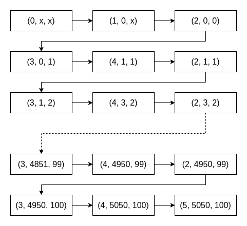
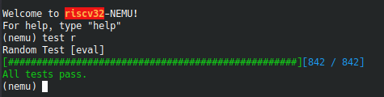

# ICS PA

## PA 0

### 1. Installing GNU/Linux

安装环境永远是最头疼的东西之一.

#### 1.1 第一个坑: WSL 不支持 systemctl 与 service 等命令

尽管在 pa0 的部分更推荐使用 vim 进行代码的编辑, 我仍然决定尝试用 VSCode 来编辑 (部分原因是已经习惯了 VSCode 的很多快捷键).

并且还想尝试一下, 用 Windows 下的 WSL2 (以下均简称为 WSL) 代替真正的 Linux 来开发, 这样就省去了在两个系统中切换的麻烦, 也能够更加方便地使用 VSCode 来开发.

因为 WSL 是 Windows 的一个子系统, 所以默认并不是以 systemd 作为初始化进程, 也就无法使用 systemctl, 如果用到了, 就会报错:

``` text
System has not been booted with systemd as init system (PID 1). Can't operate.
```

经过初步的 STFW 发现, 很多人是在 Docker 时遇到了这个问题, 对应的解决方案对我来说没有多大用处. 再经过一番痛苦的 STFW 之后, 发现了一个相对靠谱且简单的解决方案.

这里我用的 WSL 系统是 Ubuntu, 对应的解决方案为 `ubuntu-wsl2-systemd-script`:

``` bash
sudo apt install git
git clone https://github.com/DamionGans/ubuntu-wsl2-systemd-script.git
cd ubuntu-wsl2-systemd-script/
bash ubuntu-wsl2-systemd-script.sh
```

解决方案来自 [这里](https://c4ys.com/archives/2440).

#### 1.2 第二个坑: WSL 原生不支持图形界面和音频播放

在尝试运行 FCEUX 中的 mario 的时候, 果不其然, 报错了.

报错信息大概如下:

``` text
ALSA lib confmisc.c:768:(parse_card) cannot find card '0'
ALSA lib conf.c:4292:(_snd_config_evaluate) function snd_func_card_driver returned error: No such file or directory
ALSA lib confmisc.c:392:(snd_func_concat) error evaluating strings
```

经过搜寻, 大概是 WSL 中 Linux 自带的音频功能 ALSA 工作不正常, 不能使用.

尝试解决问题, 无果, 迫不得已先放弃 WSL, 果然 WSL 当成普通的 Linux 开发环境还行, 但是过于底层的开发, 或者说涉及到图形界面开发, 还是用正常一点的 Linux 环境吧.

#### 1.3 安装 Kubuntu Linux 与 Windows 双系统

Windows 下有很多资料, 也安装了很多软件, 不太想直接重装. 如果开 Linux 虚拟机的话, 又感觉没那么快乐 (奇怪的说法), 还是试试双系统吧.

先是 Manjaro, 好不容易配好了, 却发现包管理的问题很难解决, 尝试了一番, 还是打算用回 Debian 系的 Ubuntu.

但是我又不太喜 Ubuntu 默认选用的 Gnome 桌面环境, 所以最终选择了以 KDE 为桌面环境的 Kubuntu, 这样比较好看.

经过一番折腾, 终于配好了双系统到环境, 没有造成数据损失, 真是可喜可贺可喜可贺.

### 2. First Exploration with GNU/Linux

####  2.1 Why Windows is quite "fat"?

> **Question:** Installing a Windows operating system usually requires much more disk space as well as memory. Can you figure out why the Debian operating system can be so "slim"?
> 
> **Answer:** There are GUI in Windows and many other things in it, which are reserved for "compatibility". Besides, the users who use Windows usually know little knowledge about computers so that there are many functions in Windows for helping they use computer simply. However Debian is designed for professionals and many functions are used in CUI, so Debian is quite "slim". 

#### 2.2 Why executing the "poweroff" command requires superuser privilege?

> **Question:** Can you provide a scene where bad thing will happen if the poweroff command does not require superuser privilege?
>
> **Answer:** It is possible that many users are using the same Linux system in the same machine. If a normal user can poweroff the machine, other users will face the danger that their programs exit and data lost.

### 3. 《提问的智慧》读后感

每一个人, 特别是学计算机的人, 都要学会通过 STFW 和 RTFM 独立解决问题. 这是由多方原因决定的.

#### 3.1 编程的复杂性

编程在一般情况下并不是一件非常困难的工作, 但编程一定是一件复杂的工作.

软件的本质是它的复杂性, 没有足够复杂度的软件, 是无法应对用户多样性的需求的. 既然软件成品尚且如此复杂, 在编程的过程自然更加地复杂, 你必须面对多种多样的情况, 处理数不胜数的 bugs, 在极大的努力下才能做出成果.

编程的复杂性往往又会导致下面几种结果.

首先, 编程的复杂性意味着人们必须共同协作, 共同编程. 我编写的程序, 往往建立在你建立的平台上, 使用着他提供的第三方库, 最后部署在她维护的不同系统的服务器上. 这个过程往往是充满了纰漏的: 我并不知道你的平台是否稳定, 他提供的第三方库里是否存在着 bugs 甚至是后门, 她使用的服务器也不一定完全兼容我写的代码.

因为没有人能够真正完全掌握这浩如烟海的细节, 每个人能够掌控并了解的只有自己所写的那一部分, 将不同部分组合起来, 往往就会带来各种问题. 每个人写的代码不同, 遇到的问题自然也有所不同, 别人也并不了解你写的代码, 你也很难依靠别人给你一个详细的解答, 这时候, 请 STFW 和 RTFM 吧.

其次, 编程的复杂性意味着我们的工作总是"创造性"的, 即使不是"创造性"的, 至少也是"有差异的".

编程不像数学题, 大部分解答起来不困难的数学题都已经有了现成的答案, 剩下未解决的数学题往往都是非常困难的, 只有少数数学家敢于去挑战. 而编程不一样, 每一个程序, 每一个软件, 每一个应用, 都是不一样的. 即使看起来功能上大体相同, 也会在很多细节上, 或者底层实现上有相当大的差异. 再次提及这个观点: 绝大多数的编程任务并不困难, 但依然复杂.

大部分编程任务并不困难, 这意味可以让更多不能成为顶尖数学家的普通人参与进编程任务中; 编程依然复杂, 这意味着不能简单通过寻找现成的"答案"来完成一个程序的编写, 即不能自动化地完成, 也就需要许多拥有一定编程知识和经验的程序员来完成一个个的编程任务. 这些编程任务都是"创造性的"或"有差异的", 这自然使得每一个程序员都要像"创作"一样, 独立解决问题.

第三, 编程的复杂性意味着容易出现 bugs. 我们都是人类, 不是机器. 机器也许能够保证不犯错且二十四小时工作, 但是人类一定不行.

每个人都会犯错, 这个事实, 在我们上中学学习数学并参加数学考试以来, 就已经人尽皆知了. 我们做数学题会算错数, 写语文作文时会写错字, 自然在编程的时候也很可能会写下许多的 bugs. 而且往往我们自己也很难发觉为什么会引起这种 bugs. 既然最了解自己写的代码的我们也很难找出 bugs, 自然也很难指望别人帮我们找出 bugs, 最终还是得靠自己 STFW 和 RTFM.

#### 3.2 用好互联网

STFW 的意思是用好网页搜索 (Search The Friendly Web). 我们生活在互联网的时代, 我们可以很方便地在网络上搜索, 分享信息. 也许你不能在网络上找到你丢失的一双袜子, 但是对于我们犯的蠢, 很有可能在网络上发现别人也曾经犯过相同的蠢.

要善于利用出 bugs 时的报错信息, 有一些网站可以很容易地根据报错信息找出可能犯的错误, 例如网站 Stack Overflow. 即使没有现成的解答, 你也可以在相应的论坛, 或用 Github Issues 功能找到一些相关的信息.

想要更广泛, 方便地找到这些信息, 用好搜索引擎也很重要. 我们要注意: 互联网上 90% 的内容是用英语书写的, 所以我们最好用英文来搜索, 不要用中文. 而且搜索引擎最好使用 Google 这些有口皆碑的搜索引擎. 最好不要用 Baidu 搜中文信息, 更不要用 Baidu 搜英文信息, 它对信息搜集的召回率和准确率都远低于 Google. 并且, 要用好一些额外的搜索功能, 例如"用双引号括住关键词"代表了搜索出来的网页一定要包括该关键词, 用 "site:" 功能实现对指定网站内容的搜索等等.

除了搜索网页外, 我们还可以 RTFM, 即查看官方文档 (Read The Friendly Manual). 我们可以通过互联网找到相应的资源. 学会自己看文档, 对于编程来说, 非常重要.

#### 3.3 提问的方式

如果经过 STFW 和 RTFM 之后, 还是找不到解决方案, 也许你可以考虑去询问他人了.

但是, 请注意提问的方式!

别人没有义务回答你的问题, 所以你必须想办法激起别人的兴趣, 让别人乐意回答.

首先, 最重要的是准确描述问题. 准确描述问题非常重要, 你不能以一种模棱两可的方式进行提问, 例如 "为什么我的电脑突然死机了" 这种问题, 没有提供任何有用的信息, 自然也别想指望别人帮助你. 为了更好的描述问题, 你还需要讲述你为了解决这个问题所做出的努力, 例如加上 "我尝试了网上搜索出来的方案一, 问题并没有解决", 这样, 别人至少能排除一种可能的情况, 也可以知道你并非坐等其成的人. 除此之外, 最好描述你中遇到问题之前做的操作, 提供复现的方式 (例如可以复现的代码 repo), 这样能给别人帮你解决问题提供很大的便利.

其次, 要注意询问的方式. 时刻牢记, 别人没有义务为你解答, 所以不要趾高气扬地提问, 也不要抱着一种理所应当的态度. 在解决问题之后, 至少要表示你的感谢, 否则别人很可能因为你的态度, 而在下一次你提问的时候拒绝帮助你. 还有, 尽量少用私人联系方式向他人提问, 更应该中论坛, 问答网站或 Github Issues 这类公共的地点提问, 这是为了方便帮助以后再次碰到类似问题的人, 这样他们就可以通过 STFW 找到答案, 避免了重复提问与重复回答.

#### 3.4 总结

提问的智慧很重要, 而学会通过 STFW 和 RTFM 独立解决问题, 是避免发起不必要提问的好办法. 先学会独立解决问题, 这才是最好的提问的智慧.


## PA 1

### 1. RTFSC

#### 1.1 从状态机视角理解程序运行



#### 1.2 实现 x86 的寄存器结构体

使用匿名 union, 修改后的代码如下:

``` c
typedef struct {
    union {
        struct {
            union {
                uint32_t _32;
                uint16_t _16;
                uint8_t _8[2];
            };
        } gpr[8];

        /* Do NOT change the order of the GPRs' definitions. */

        /* In NEMU, rtlreg_t is exactly uint32_t. This makes RTL instructions
         * in PA2 able to directly access these registers.
         */
        struct {
            rtlreg_t eax, ecx, edx, ebx, esp, ebp, esi, edi;
        };
    };

    vaddr_t pc;
} x86_CPU_state;
```

#### 1.3 尝试使用 vscode + gdb 进行调试并完善相关配置

直接使用 gdb 还是感觉太麻烦了, 执行需要各种各样的命令, 而且代码查看和跳转也不方便.

这种时候还是要有像正常 IDE 那样的调试界面才快乐啊. 所以我把目光投向了 VSCode 的调试功能. VSCode 既有 IDE 的强大, 有着可以媲美 Vim 的强大功能, 又有着对命令行功能的良好适配. 其中 VSCode 对 C 和 C++ 语言的调试功能正是通过 gdb 实现的, 所以我们可以很容易地进行一些配置, 使得 VSCode 的调试功能适配 NEMU 项目.

我们只需要添加两个文件, 第一个是 `tasks.json`:

``` json
{
    "version": "2.0.0",
    "options": {
        "cwd": "${workspaceRoot}/nemu" // $ nemu 路径
    },
    "tasks": [
        {
            "label": "make", // 任务名称, 与 launch.json 的 preLaunchTask 相对应
            "command": "make",
            "args": [
                "vscode" // 对应 `make vscode`, 类似于 `make gdb`, 但实际上用的是 vscode 的调试功能
            ],
            "type":"shell"
        },
        {
            "label": "kill",
            "command": "killall", // 即执行 killall -9 x-terminal-emulator 杀死进程
            "args": [
                "-9",
                "x-terminal-emulator"
            ],
            "type":"shell"
        }
    ]
}
```

其对应着命令 `make vscode`, 即在执行前, 重新生成可执行程序, 然后使用 VSCode 调试, 结束调试之后执行 `killall -9 x-terminal-emulator` 杀死进程.

这里是我修改过的 Makefile (修改 `native.mk` 文件), 以便能正常地跟踪我的 VSCode 调试, 其中 `script/native.mk` 的修改为 (即去除默认的调试, 使用 VSCode 的调试功能进行调试运行):

``` makefile
--- .PHONY: run gdb run-env clean-tools clean-all $(clean-tools)
+++ .PHONY: run gdb vscode run-env clean-tools clean-all $(clean-tools)

+++ vscode: run-env
+++ 	$(call git_commit, "gdb")
```

第二个是 `launch.json`:

``` json
{
    "version": "0.2.0",
    "configurations": [
        {
            "name": "Debug nemu", // 配置名称, 将会在启动配置的下拉菜单中显示
            "type": "cppdbg", // 配置类型, 这里只能为cppdbg
            "request": "launch", // 请求配置类型, 可以为 launch (启动) 或 attach (附加) 
            "program": "${workspaceRoot}/nemu/build/riscv32-nemu-interpreter", // 将要进行调试的程序的路径
            "stopAtEntry": false, // 设为 true 时程序将暂停在程序入口处
            "cwd": "${workspaceRoot}/nemu", // 调试程序时的工作目录
            "environment": [], // 环境变量 
            "externalConsole": true, // 调试时是否显示控制台窗口, 一般设置为 true 显示控制台
            "MIMode": "gdb", // 指定连接的调试器, 可以为 gdb 或 lldb
            "preLaunchTask": "make", // 调试会话开始前执行的任务, 一般为编译程序. 与 tasks.json 的 taskName 相对应，可根据需求选择是否使用
            "postDebugTask": "kill", // 在退出之后, 执行 "killall -9 x-terminal-emulator" 杀死进程
        }
    ]
}
```

<!-- $ -->

这个是使用 VSCode 进行调试的关键, 它先使用 `preLaunchTask` 执行了可执行程序的生成指令 `make vscode`, 然后再使用 gdb 运行并附加到 `/nemu/build/riscv32-nemu-interpreter` 这个编译生成的文件.

相当于命令 `gdb ./nemu/build/riscv32-nemu-interpreter`.

最后, 我们要注意, 使用 `make nemuconfig`, 然后开启选项:

```
Build Options
  [*] Enable debug information
```

这样就配置完成了, 我们可以很简单地在 VSCode 中配置断点, 并按下 F5 运行程序开始调试. 这不比 gdb 香? (不是


#### 1.4 一个程序从哪里开始执行呢?

> **Question:** 一个程序从哪里开始执行呢?
>
> **Answer:** 如果只是按照我们在程序设计中学过的课程来说, 似乎就是从 `main()` 函数开始执行. 但实际上, 就算只是用我们已经学过的知识, 都可以知道不可能是从 `main()` 函数开始执行. 例如, **全局变量的初始化**应该放在什么地方呢? 一个程序从哪里开始执行, 我也许得等到学完了编译原理才能知道.

#### 1.5 为什么全都是函数?

> **Question:** 阅读 `init_monitor()` 函数的代码, 你会发现里面全部都是函数调用. 按道理, 把相应的函数体在 `init_monitor()` 中展开也不影响代码的正确性. 相比之下, 在这里使用函数有什么好处呢?
>
> **Answer:** 好处是可读性更强, 并且可以将不同功能的代码分散到不同的文件中, 这样便更有条理, 不至于导致一个文件上千上万行的惨状.

#### 1.6 参数的处理过程

> **Question:** `parse_args()` 的参数是从哪里来的呢?
> 
> **Answer:** 从启动该程序时附带的参数中来. 例如我们常见的命令 `man xxx`, 其中 `man` 其实是一个程序, 我们要求其中这个叫 `man` 的程序, 而后面紧跟的 `xxx` 便是参数. 类似的, `parse_args()` 的参数就是从这里来的.

#### 1.7 "reg_test()" 是如何测试你的实现的?

> **Question:** 阅读 `reg_test()` 的代码, 思考代码中的 `assert()` 条件是根据什么写出来的.
> 
> **Answer:** `sample[R_EAX] & 0xff` 这种写法, 是取出 EAX 寄存器中的低 8 位, 于是 `assert(reg_b(R_AL) == (sample[R_EAX] & 0xff));` 就是判断两者是否一致, 其他的也类似.

#### 1.8 究竟要执行多久?

> **Question:** 在 `cmd_c()` 函数中, 调用 `cpu_exec()` 的时候传入了参数 `-1`, 你知道这是什么意思吗?
> 
> **Answer:** 仔细观察代码不难发现, `cpu_exec()` 定义为 `void cpu_exec(uint64_t)`, 即参数是无符号的. 于是我们传入的 `-1`, 实际上是变成了一个最大的数, 这样就能让程序一直运行, 直到退出为止.

#### 1.9 潜在的威胁

> **Question:** "调用 `cpu_exec()` 的时候传入了参数-1", 这一做法属于未定义行为吗? 请查阅 C99 手册确认你的想法.
> 
> **Answer:** 并不属于. `-1` 是有符号数, 有符号数转为无符号数的时候, 均为直接转换, `-1` 便会转为一个很大的无符号数, 这并不属于未定义行为.

#### 1.10 谁来指示程序的结束?

> **Question:** 在程序设计课上老师告诉你, 当程序执行到 `main()` 函数返回处的时候, 程序就退出了, 你对此深信不疑. 但你是否怀疑过, 凭什么程序执行到 `main()` 函数的返回处就结束了? 如果有人告诉你, 程序设计课上老师的说法是错的, 你有办法来证明/反驳吗? 如果你对此感兴趣, 请在互联网上搜索相关内容.
> 
> **Answer:** 并没有直接退出, 还需要释放各种资源, 如全局变量, 打开的文件, 设备等. 

#### 1.11 优美地退出

> **Question:** 之间键入 `q` 后退出, 会发现终端出现了错误信息 `make: *** [/home/orangex4/ics2021/nemu/scripts/native.mk:23：run] 错误 1`, 该怎么解决这个问题?
>
> **Answer:** 经过调试发现, 是最后 `main()` 调用 `is_exit_status_bad()` 的时候, `utils/state.c` 中的代码 `NEMUState nemu_state = { .state = NEMU_STOP };` 出现了错误, 这里应该是 "退出" 而不是 "停止", 因此, 修改为 `NEMUState nemu_state = { .state = NEMU_QUIT };` 之后, 代码就恢复了正常, 退出时也就不会报错了.


### 2. 阶段一: 基础设施

#### 2.1 实现基本命令

基本命令实现起来没有太大的困难, 文档描述得十分详细, 只要先初步了解大致的代码架构, 就能往里面填充代码.

单步执行命令 `si [N]` 比较简单. 其最核心的代码, 就是调用函数 `cpu_exec(n)`. 理解了这一层, 就没有什么困难的地方了. 其他细节的地方, 例如 `atoi` 函数将字符串转为整数, 还有一些错误处理. 

打印寄存器状态的命令 `info r` 稍微麻烦一点. 主要麻烦的地方在于, 不同的 ISA 有着不同的寄存器结构. 但是这也麻烦不到哪里去, 特别是对于 riscv32 架构, 打印起来寄存器信息相对比较简单.

在实现打印寄存器命令的时候, 我遇到的主要困难是不太清楚寄存器的数据的存储位置. 在认真阅读了代码之后, 我逐渐了解到, 只需要在 `isa_reg_display()` 函数中调用全局变量 `cpu`, 就能获取到寄存器信息. 对于 riscv32 架构来说, 就是 `cpu.gpr[i]._32`.

扫描内存的指令 `x N EXPR` 实现起来也不困难, 并且文档中也详细地写出了应该如何读取内存数据:

> 内存通过在 `nemu/src/memory/paddr.c` 中定义的大数组 `pmem` 来模拟. 在客户程序运行的过程中, 总是使用 `vaddr_read()` 和 `vaddr_write()` (在 `nemu/include/memory/vaddr.h` 中定义) 来访问模拟的内存. `vaddr`, `paddr` 分别代表虚拟地址和物理地址.

要注意的就是, 需要引入头文件 `include <memory/vaddr.h>` 才能使用 `vaddr_read()` 函数.

#### 2.2 如何测试字符串处理函数?

> **Question:** 你可能会抑制不住编码的冲动: 与其RTFM, 还不如自己写. 如果真是这样, 你可以考虑一下, 你会如何测试自己编写的字符串处理函数?
> 
> **Answer:** 使用简单的单元测试, 手动或自动构造测试样例, 并使用类似 `Assert()` 之类的方法进行测试.

#### 2.3 实现单步执行, 打印寄存器, 扫描内存

> **Question:** 为了查看单步执行的效果, 你可以把nemu/include/common.h中的DEBUG宏打开, 这样以后NEMU会把单步执行的指令打印出来(这里面埋了一些坑, 建议你RTFSC看看指令是在哪里被打印的).
> 
> **Answer:** DEBUG 宏已经是默认打开了的, 所以会有相应的显示. 其中的坑是操作数或寄存器与目标寄存器的顺序不对, 如本应显示为 "lui t0,0x80000000" 的指令显示成了 "lui 0x80000000,t0". 经过调试, 发现具体的输出指令在文件 `nemu/include/cpu/decode.h` 对应的宏中. 具体的修改方式如下:
> ```
> --- #define print_asm_template2(instr) \
> ---   print_asm(str(instr) "%c %s,%s", suffix_char(id_dest->width), id_src1->str, id_dest->str)
> --- #define print_asm_template3(instr) \
> ---   print_asm(str(instr) "%c %s,%s,%s", suffix_char(id_dest->width), id_src1->str, id_src2->str, id_dest->str)
> 
> +++ #define print_asm_template2(instr) \
> +++   print_asm(str(instr) "%c %s,%s", suffix_char(id_dest->width), id_dest->str, id_src1->str)
> +++ #define print_asm_template3(instr) \
> +++   print_asm(str(instr) "%c %s,%s,%s", suffix_char(id_dest->width), id_dest->str, id_src1->str, id_src2->str)
> ```


### 3. 阶段二: 表达式求值

表达式求值部分相对麻烦一些, 特别是考虑到各种粗枝末节之后.

首先要完成表达式求值最基本的功能, 基础数学表达式的**词法分析**和**语法分析**.

#### 3.1 词法分析

最简单的词法分析实现起来并不算太困难. 特别是允许使用正则表达式来进行词法, 让整个过程轻松了许多. 注意好转译, 加减乘除括号这些符号识别起来几乎没有任何难度；真正麻烦的是**数字**的识别.

最简单的识别数字的表达式应该是 `[0-9]+`, 匹配形如 `12345`, `01`, `100` 这样的**十进制数字**. (感谢 RegExr 让我可以很方便地书写正则表达式).

想要判断一个 "-" 是减号还是负号是一件麻烦的事, 古老的 `regcomp` 既不支持 `\d`, 也不支持 `negative lookbehind`. 那对于负数就没什么办法了, 只能用 `[0-9]+` 匹配出数字, 然后再根据前面有无数字, 从而判断是负号还是减号. 负号对应的是**单目操作符**, 减号对应的是**双目操作符**. 就这样, 解决了负数的问题.

还有一个血的教训: 使用 `strncpy(dest, str, n)` 进行字符串截取的时候, 一定要在后面加上一句 `dest[n] = '\0'`, 不然字符串没有结束符, 就会导致各种各样的奇怪 bug.

#### 3.2 语法分析

实现数学表达式的求值, 我们可以用递归求值的方法. 文档中已经解释了大部分的代码和思路, 只需要简单地填入代码即可. 相当于我们只需要写 `check_parentheses(p, q)` 和 `get_op(p, q)` 这两个函数即可.

并且由于负数的引进, 增加了**单目运算符**, 因而代码也需要相应的更改.

#### 3.3 单元测试

在实现表达式求值算法时, 很容易在细节的地方出 bug, 这时候, **单元测试**的重要性以及必要性就体现了出来. 于是我又加入了一个简单的命令 `test`, 并优化了 `Log` 的输出与开关, 就可以进行简单的单元测试了.

并且, 做好了随机测试算法, 生成了数千个样本, 在改了几个 bugs 之后, 全部样本都通过了.



(样本保存在 `nemu/tools/gen-expr/input.txt` 中.)

#### 3.4 为什么 "printf()" 的输出要换行?

> **Question:** 为什么 `printf()` 的输出要换行? 如果不换行, 可能会发生什么? 
> 
> **Answer:** 不换行的话, 输出内容会挤成一堆, 难以观看.

#### 3.5 表达式生成器如何获得C程序的打印结果?

> **Question:** 表达式生成器如何获得C程序的打印结果?
>
> **Answer:** 使用 `popen()` 打开一个可执行文件之后, 可以使用 `fscanf()` 获取程序的输出内容. 其实这也恰好吻合了 Linux 的哲学: 一切皆文件. 我们可以用类似于操作文件读写的方式, 对可执行程序的输入输出进行读写.

#### 3.6 为什么要使用无符号类型?

> **Question:** 我们在表达式求值中约定, 所有运算都是无符号运算. 你知道为什么要这样约定吗? 如果进行有符号运算, 有可能会发生什么问题?
> 
> **Answer:** 如果进行有符号数的运算, 就可能会出现 "减号 + 负数" 的情况, 类似于 "1 - -1", 这时候 C 语言的编译器会认为 "--1" 是自减操作, 便会报错.

#### 3.7 除 0 的确切行为

> **Question:** 如果生成的表达式有除0行为, 你编写的表达式生成器的行为又会怎么样呢?
>
> **Answer:** 如果有明显的除零行为, 例如 `1 / 0`, 编译器编译的时候就会报错, 即 `ret = system("gcc /tmp/.code.c -o /tmp/.expr")` 执行后 `ret` 就不等于零了. 但是对于复杂一点的除零行为, 例如 `1 / ( 0 / 1 )`, 编译器是检测不出来的, 这时候只能等到运行时才能报错, 即使用 `ret = pclose(fp)` 获取退出码, `ret` 不等于零, 代表未正常退出, 就说明表达式除零了, 得舍去.


### 4. 阶段三: 监视点

#### 4.1 扩展表达式求值的功能: 用栈 (Stack) 计算表达式

如果我还是沿用阶段二的那种递归式求表达式的值的方法的话, `get_op()` 操作符优先级的问题会弄得我焦头烂额, 根本无从下手.

所以我决定用栈 (Stack) 重构表达式求值的部分, 这样在后续添加新的操作符会非常方便.

用栈计算表达式部分的思想参考了这篇文章: [Infix to Postfix/Prefix converter](https://www.web4college.com/converters/infix-to-postfix-prefix.php).

大概思路如下:

1. Scan input string from left to right character by character.
2. If the character is an operand, put it into output stack.
If the character is an operator and operator's stack is empty, push operator into operators' stack.
1. If the operator's stack is not empty, there may be following possibilities.
2. If the precedence of scanned operator is greater than the top most operator of operator's stack, push this operator into operand's stack.
3. If the precedence of scanned operator is less than or equal to the top most operator of operator's stack, pop the operators from operand's stack until we find a low precedence operator than the scanned character. Never pop out ( '(' ) or ( ')' ) whatever may be the precedence level of scanned character.
4. If the character is opening round bracket ( '(' ), push it into operator's stack.
5. If the character is closing round bracket ( ')' ), pop out operators from operator's stack until we find an opening bracket ('(' ).
6. Now pop out all the remaining operators from the operator's stack and push into output stack.

我实现了两个数据结构: `Stack` 和 `Map`, 存放在 `struct.c` 中. 使用这种方法重构之后, 我就可以很方便地添加各种操作符了.

最终, 我实现的表达式求值的功能如下:

``` c
static struct rule {
    char *regex;
    int token_type;
} rules[] = {

    {" +", TK_NOTYPE},              // spaces
    {"\\$[a-z]*[0-9]*", TK_REG},    // reg
    {"0[xX][0-9a-fA-F]+", TK_HEX},  // hex number
    {"[0-9]+", TK_NUMBER},          // number
    {"\\!", '!'},                   // not
    {"\\~", '~'},                   // bitwise not
    {"\\+", '+'},                   // plus
    {"-", '-'},                     // minus or negative
    {"\\*", '*'},                   // multiply
    {"\\/", '/'},                   // divide
    {"\\\%", '%'},                  // mod
    {"\\(", '('},                   // left bracket
    {"\\)", ')'},                   // right bracket
    {"<<", TK_LS},                  // left shift
    {">>", TK_RS},                  // right shift
    {">=", TK_GTE},                 // greater than or equal to
    {"<=", TK_LTE},                 // less than or equal to
    {">", TK_GT},                   // greater than
    {"<", TK_LT},                   // less than
    {"==", TK_EQ},                  // equal
    {"!=", TK_NEQ},                 // not equal
    {"&&", TK_AND},                 // and
    {"\\|\\|", TK_OR},              // or
    {"&", TK_BAND},                 // bitwise and
    {"\\|", TK_BOR},                // bitwise or
    {"\\^", TK_XOR},                // bitwise xor
};
```

#### 4.2 温故而知新: static 的含义

> **Question:** 框架代码中定义 `wp_pool` 等变量的时候使用了关键字 `static`, `static` 在此处的含义是什么? 为什么要在此处使用它?
>
> **Answer:** `static` 是 "静态" 的意思, 在此处指静态全局变量. 静态全局变量与全局变量的区别在于, 如果程序包含多个文件的话, 它作用于定义它的文件里, 不能作用到其它文件里, 即被 `static` 关键字修饰过的变量具有文件作用域. 这样即使两个不同的源文件都定义了相同名字的静态全局变量, 它们也是不同的变量.